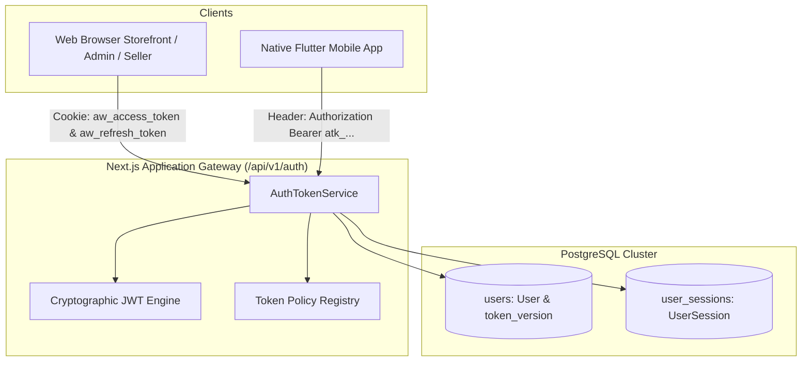
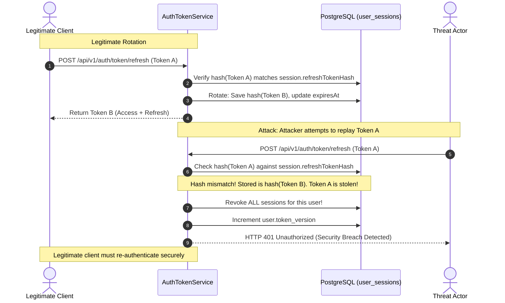

# Authentication Architecture and Token Policy Specification

## 1. Executive Summary

Milestone 031 initiates **Phase 04: Identity and Authentication**. The objective of this phase is to deliver secure, enterprise-grade multi-role identity flows suitable for both desktop/mobile web browsers and native Flutter applications across Bangladesh.

This specification formalizes:
1. **The Dual-Client Authentication Strategy**: Combining strict `HttpOnly` SameSite cookies for browsers with Bearer JSON tokens for Flutter mobile apps.
2. **Authoritative Token Lifecycles & TTLs**: Short-lived Access Tokens (15 min) and long-lived Refresh Tokens (7 days web / 30 days mobile).
3. **Single-Use Refresh Token Rotation & Reuse Detection**: Immediate invalidation of all user sessions upon detection of token reuse or replay attacks.
4. **Global Revocation Invariants**: Atomic `tokenVersion` increments on the `User` model, invalidating all outstanding JWTs instantly across all devices.
5. **Cryptographic Standards**: HS256 JWT signing with constant-time signature verification and PBKDF2-HMAC-SHA512 password derivation (100,000 iterations, 32-byte salt).

---

## 2. Dual-Client Architecture Overview



### Client Handling Matrix

| Client Platform | Access Token Transport | Refresh Token Transport | Storage Medium | CSRF Protection |
|---|---|---|---|---|
| **Web Storefront & Portals** | `aw_access_token` Cookie (`HttpOnly`, `SameSite=Lax`, `Path=/`, `Max-Age=900s`) | `aw_refresh_token` Cookie (`HttpOnly`, `SameSite=Lax`, `Path=/api/v1/auth`, `Max-Age=7d`) | Secure Browser Cookie Jar | SameSite cookie policy + Origin header validation |
| **Flutter Mobile App** | `Authorization: Bearer <token>` HTTP Header | JSON response payload `{ refreshToken }` | Flutter Secure Storage (Keychain / Android Keystore) | Native client isolation (immune to browser CSRF) |

---

## 3. Token Lifecycles & Exact TTL Specifications

| Token Type | Purpose | TTL | Revocation Mechanism |
|---|---|---|---|
| **Access Token (`JWT`)** | Stateless API authorization carrying user ID, roles, permissions, and seller scoping | **15 minutes** (900 seconds) | Expiration, underlying session revocation, or `tokenVersion` mismatch |
| **Web Refresh Token (`JWT`)** | Single-use rotating credential for renewing web sessions | **7 days** (604,800 seconds) | Rotated on every use; invalidated on logout or breach |
| **Mobile Refresh Token (`JWT`)** | Single-use rotating credential for native mobile Flutter apps | **30 days** (2,592,000 seconds) | Rotated on every use; invalidated on logout or breach |
| **Session Inactivity** | Automatic expiration of abandoned active sessions | **48 hours** (172,800 seconds) | Updated on each active request (`touchSession`) |
| **OTP Token** | Ephemeral verification code for email/SMS | **5 minutes** (300 seconds) | Single-use flag (`isUsed`) + max 3 attempts |

---

## 4. Single-Use Refresh Token Rotation & Reuse Detection

To prevent token replay and session hijacking, AlifWorld enforces **Single-Use Refresh Token Rotation with Immediate Family Revocation**:



---

## 5. Global Token Version Invalidation

When a sensitive security event occurs (e.g. password change, password reset, account recovery, or administrator intervention):
1. The user's `tokenVersion` column on the `users` table is atomically incremented:
   ```sql
   UPDATE users SET token_version = token_version + 1 WHERE id = $userId;
   ```
2. All active records in `user_sessions` for that user are marked `is_revoked = true`.
3. Any existing Access Token presenting the old `tokenVersion` is rejected immediately by the introspection layer and gateway middleware.

---

## 6. Password Complexity & Hashing Standards

### Password Policy
- **Minimum Length**: 8 characters
- **Maximum Length**: 128 characters
- **Complexity Requirements**:
  - At least one uppercase Latin letter (`[A-Z]`)
  - At least one lowercase Latin letter (`[a-z]`)
  - At least one numeric digit (`[0-9]`)
  - At least one special symbol (`[!@#$%^&*()_+\-=\[\]{};':"\\|,.<>\/?]`)

### Cryptographic Derivation
- Algorithm: **PBKDF2-HMAC-SHA512**
- Iterations: **100,000**
- Salt: **32 bytes** generated cryptographically via `crypto.randomBytes(32)`
- Key Length: **64 bytes**
- Format: `$pbkdf2-sha512$i=100000$<saltHex>$<derivedKeyHex>`
- Verification: Constant-time comparison using `timingSafeEqual()`

---

## 7. Role-Based Access Control (RBAC) Hierarchy

| Role Code | Tier | Scope | Typical Permissions |
|---|---|---|---|
| `SUPER_ADMIN` | Platform | Global | Full platform access, financial adjustments, system configurations |
| `ADMIN` | Platform | Global | Catalog approval, merchant management, compliance audits |
| `OPERATIONS` | Platform | Global | Warehouse routing, dispute resolution, logistics oversight |
| `SUPPORT` | Platform | Read-heavy | Customer ticket inspection, order tracking, read-only wallets |
| `SELLER_OWNER` | Merchant | Scoped (`sellerId`) | Full merchant portal management, payouts, catalog publishing |
| `SELLER_STAFF` | Merchant | Scoped (`sellerId`) | Inventory adjustments, fulfillment pack/ship operations |
| `CUSTOMER` | Consumer | Self | Browsing, ordering, personal wallet, points, profile |
| `RIDER` | Logistics | Scoped | Delivery acceptance, pickup verification, proof-of-delivery |
