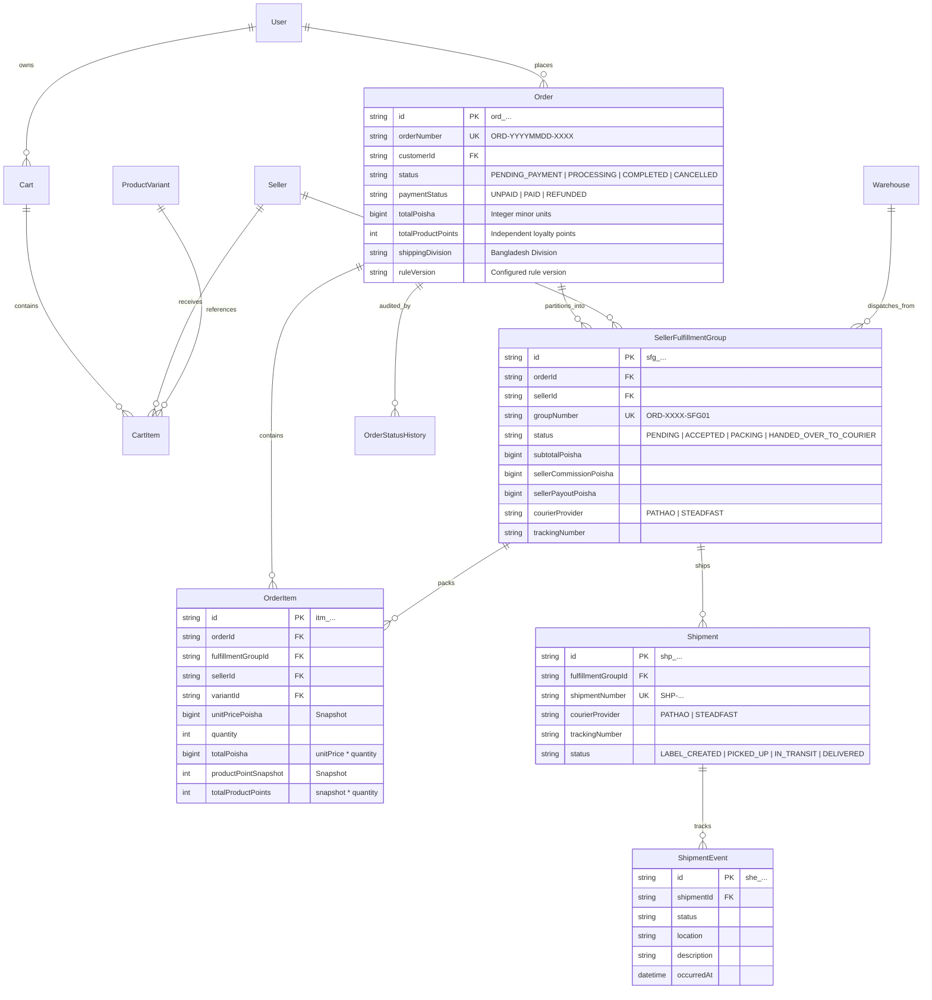
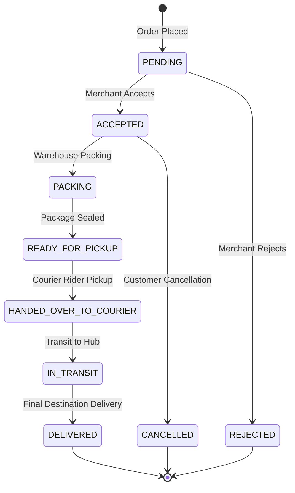

# Carts, Orders, Seller Fulfillment Groups, and Shipments Architecture Specification

## 1. Executive Summary

Milestone 027 establishes AlifWorld's foundational order orchestration, multi-vendor fulfillment partitioning, and shipment tracking engine. It satisfies **ADR-0027**, **ADR-0003**, **ADR-0022**, and **ADR-0025**.

The architecture reconciles two opposing requirements in modern multi-vendor commerce:
1. **Single Customer Unified Experience**: The buyer experiences a consolidated cart, single payment transaction, unified receipt, and holistic order tracking.
2. **Strict Multi-Tenant Merchant Isolation**: Merchants operate in isolated tenants (`sellerId` query scoping) and see only the fulfillment line items, addresses, and payouts belonging to their store.

---

## 2. Core Invariants & Mathematical Guarantees

### Milestone 091 Checkout Snapshot Contract (in progress)

- `POST /api/v1/cart` accepts `variantId` and positive integer `quantity`; it
    reads the BDT poisha price and independent Product Points from an active
    published variant owned by a verified seller. Client-supplied price or Point
    fields are not used. `PATCH/DELETE /api/v1/cart/items/{itemId}` require the
    authenticated cart owner and update the cart version in the same transaction.
- `POST /api/v1/cart/checkout` requires an `Idempotency-Key` header (8-128
    permitted characters) alongside its existing `{cartId, checkout}` JSON body.
    The owned cart's creation date and a SHA-256 digest of cart ID, actor ID,
    key, and validated shipping payload produce a stable unique order number.
    A retry with the same key and payload returns the committed order. A changed
    payload cannot replay that order and conflicts after the cart is converted.
    Concurrent claims also re-read the committed order before returning a conflict.
    Clients must retain the same key for uncertain responses. The digest is not
    an authorization credential; cart ownership is still checked first.

- Actor: the authenticated customer who owns an active BDT cart. Other users, guest
    carts, non-BDT carts and converted carts cannot create an order. Seller and Admin
    actors do not receive an exception to customer ownership at checkout.
- Input: stored cart item price in integer poisha, positive safe-integer quantity,
    and independent non-negative integer Product Points per unit. Invalid values fail
    with a validation error before order insertion. The order item stores the captured
    unit price, multiplied line total, per-unit Points and multiplied Point total.
    Points are *recorded*, not posted to a wallet at checkout.
- Transition: ACTIVE cart to CONVERTED cart and creation of the pending order,
    seller fulfillment groups and item snapshots occur in one database transaction.
    Cart edits advance the cart version under the same row lock, and checkout claims
    only the version read with its item snapshots. A competing claim returns a
    conflict; a failed transaction restores the cart's active state. Order creation
    is audited after commit, but audit delivery is not
    transactionally guaranteed by this implementation.
- Ownership: the order references the customer; each fulfillment group and item
    retains the seller ID. Existing seller queries must enforce seller-tenant scope.
    Historical item amounts must not be recomputed after variant edits.
- Outstanding gates: verify concurrent item edits, retries and checkout against
    an isolated migrated PostgreSQL database; integrate a real published-product
    storefront journey; approve versioned tax/shipping/commission rules before
    replacing the legacy defaults; resolve the milestone's legal and reward-posting
    approvals. The present `v1.0.0` default is not evidence of approved pricing rules.


### Invariant 1: Integer Minor Units for Monetary Values (Poisha)
All monetary attributes (`subtotalPoisha`, `discountPoisha`, `shippingFeePoisha`, `taxPoisha`, `totalPoisha`, `sellerCommissionPoisha`, `sellerPayoutPoisha`) are represented as integer minor units (`BigInt` poisha, where $1\text{ BDT} = 100\text{ poisha}$). Floating-point values are strictly prohibited in database storage and domain logic.

$$\text{TotalPoisha} = \text{SubtotalPoisha} + \text{ShippingFeePoisha} + \text{TaxPoisha} - \text{DiscountPoisha}$$

### Invariant 2: Decoupled Independent Product Points (PP)
Product Points are discrete integer tokens ($PP \in \mathbb{N}_0$) allocated per SKU. **The platform never infers a conversion rate between BDT currency and Product Points.** Points are frozen as an immutable snapshot at the moment of order placement:

$$\text{LinePoints} = \text{ProductPointSnapshot} \times \text{EligibleQuantity}$$

Points remain in an unreleased escrow status until the parent order transitions to `COMPLETED` and the statutory consumer return/inspection window closes.

### Invariant 3: Multi-Vendor Fulfillment Group Splitting
When a customer purchases items from $N$ different merchants in a single checkout, the engine partitions the cart into exactly $N$ distinct `SellerFulfillmentGroup` entities. Each group:
- Has a unique identifier `sfg_...` and reference number `ORD-XXXX-SFG01`.
- Has its own courier provider and tracking number.
- Advances along its own state machine independently of other merchants.
- Computes platform commission (default 5%) and net seller payout.

### Invariant 4: Append-Only Immutability for Audit History
Every state transition on an order or shipment writes an append-only log record (`OrderStatusHistory`, `ShipmentEvent`). These models are classified as `IMMUTABLE` in `src/shared/database/lifecycle.ts`. Deletion (hard or soft) and modification are strictly forbidden.

---

## 3. Entity-Relationship Diagram



---

## 4. Fulfillment State Machine



---

## 5. Security & Multi-Tenant Query Scoping

All seller-facing queries are scoped inside repository queries using the authenticated seller's ID:

```typescript
// Enforced pattern in OrderRepository
const where = this.whereNotDeleted({
  sellerId: authenticatedSellerId,
  ...(status ? { status } : {}),
});
```

Cross-tenant access attempts detect tenant mismatches using `assertSellerScope(entitySellerId, authorizedSellerId)` and immediately reject with HTTP 403 `AuthorizationError`.
