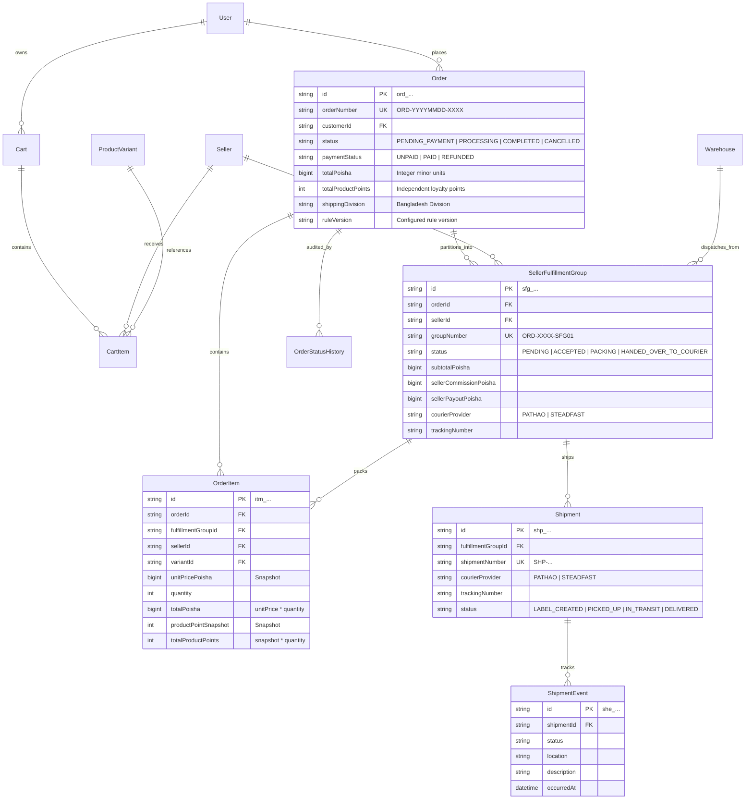
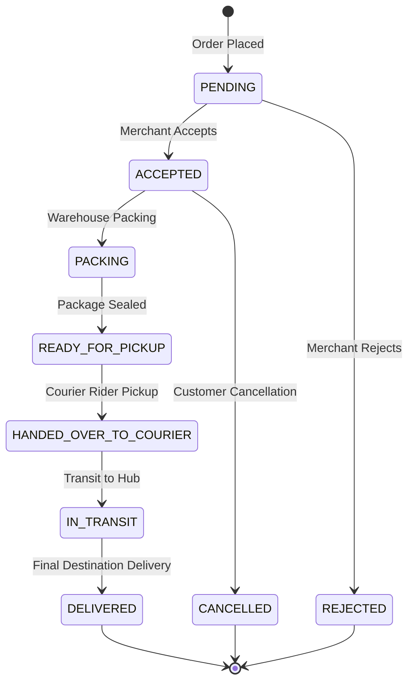

# Carts, Orders, Seller Fulfillment Groups, and Shipments Architecture Specification

## 1. Executive Summary

Milestone 027 establishes AlifWorld's foundational order orchestration, multi-vendor fulfillment partitioning, and shipment tracking engine. It satisfies **ADR-0027**, **ADR-0003**, **ADR-0022**, and **ADR-0025**.

The architecture reconciles two opposing requirements in modern multi-vendor commerce:

1. **Single Customer Unified Experience**: The buyer experiences a consolidated cart, single payment transaction, unified receipt, and holistic order tracking.
2. **Strict Multi-Tenant Merchant Isolation**: Merchants operate in isolated tenants (`sellerId` query scoping) and see only the fulfillment line items, addresses, and payouts belonging to their store.

---

## 2. Core Invariants & Mathematical Guarantees

### Milestone 091 Checkout Snapshot Contract (in progress)

- `POST /api/v1/cart` accepts `variantId` and positive integer `quantity`; it
  reads the BDT poisha price and independent Product Points from an active
  published variant owned by a verified seller. Client-supplied price or Point
  fields are not used. `PATCH/DELETE /api/v1/cart/items/{itemId}` require the
  authenticated cart owner and update the cart version in the same transaction.
- `POST /api/v1/cart/checkout` requires an `Idempotency-Key` header (8-128
  permitted characters) alongside its existing `{cartId, checkout}` JSON body.
  The owned cart's creation date and a SHA-256 digest of cart ID, actor ID,
  key, and validated shipping payload produce a stable unique order number.
  A retry with the same key and payload returns the committed order. A changed
  payload cannot replay that order and conflicts after the cart is converted.
  Concurrent claims also re-read the committed order before returning a conflict.
  Clients must retain the same key for uncertain responses. The digest is not
  an authorization credential; cart ownership is still checked first.

- Actor: the authenticated customer who owns an active BDT cart. Other users, guest
  carts, non-BDT carts and converted carts cannot create an order. Seller and Admin
  actors do not receive an exception to customer ownership at checkout.
- Input: stored cart item price in integer poisha, positive safe-integer quantity,
  and independent non-negative integer Product Points per unit. Invalid values fail
  with a validation error before order insertion. The order item stores the captured
  unit price, multiplied line total, per-unit Points and multiplied Point total.
  Points are _recorded_, not posted to a wallet at checkout.
- Transition: ACTIVE cart to CONVERTED cart and creation of the pending order,
  seller fulfillment groups and item snapshots occur in one database transaction.
  Cart edits advance the cart version under the same row lock, and checkout claims
  only the version read with its item snapshots. A competing claim returns a
  conflict; a failed transaction restores the cart's active state. Order creation
  is audited after commit, but audit delivery is not
  transactionally guaranteed by this implementation.
- Ownership: the order references the customer; each fulfillment group and item
  retains the seller ID. Existing seller queries must enforce seller-tenant scope.
  Historical item amounts must not be recomputed after variant edits.
- Outstanding gates: verify concurrent item edits, retries and checkout against
  an isolated migrated PostgreSQL database; integrate a real published-product
  storefront journey; approve versioned tax/shipping/commission rules before
  replacing the legacy defaults; resolve the milestone's legal and reward-posting
  approvals. The present `v1.0.0` default is not evidence of approved pricing rules.

### Invariant 1: Integer Minor Units for Monetary Values (Poisha)

All monetary attributes (`subtotalPoisha`, `discountPoisha`, `shippingFeePoisha`, `taxPoisha`, `totalPoisha`, `sellerCommissionPoisha`, `sellerPayoutPoisha`) are represented as integer minor units (`BigInt` poisha, where $1\text{ BDT} = 100\text{ poisha}$). Floating-point values are strictly prohibited in database storage and domain logic.

$$\text{TotalPoisha} = \text{SubtotalPoisha} + \text{ShippingFeePoisha} + \text{TaxPoisha} - \text{DiscountPoisha}$$

### Invariant 2: Decoupled Independent Product Points (PP)

Product Points are discrete integer tokens ($PP \in \mathbb{N}_0$) allocated per SKU. **The platform never infers a conversion rate between BDT currency and Product Points.** Points are frozen as an immutable snapshot at the moment of order placement:

$$\text{LinePoints} = \text{ProductPointSnapshot} \times \text{EligibleQuantity}$$

Points remain unreleased until an approved, versioned eligibility rule and its dedicated posting workflow exist. No eligible status or inspection period is inferred from this document. Generic completion transitions fail closed.

### Invariant 3: Multi-Vendor Fulfillment Group Splitting

When a customer purchases items from $N$ different merchants in a single checkout, the engine partitions the cart into exactly $N$ distinct `SellerFulfillmentGroup` entities. Each group:

- Has a unique identifier `sfg_...` and reference number `ORD-XXXX-SFG01`.
- Has its own courier provider and tracking number.
- Advances along its own state machine independently of other merchants.
- Retains the snapshotted commission and payout values and their rule version; transitions do not invent a default percentage or recalculate historical amounts.

### Invariant 4: Append-Only Immutability for Audit History

Every state transition on an order or shipment writes an append-only log record (`OrderStatusHistory`, `ShipmentEvent`). These models are classified as `IMMUTABLE` in `src/shared/database/lifecycle.ts`. Deletion (hard or soft) and modification are strictly forbidden.

### Milestone 142 Transition Contract (Not Yet Accepted)

The canonical order, fulfillment-group, and item maps live in `src/features/orders/state-machines/order-state-machine.ts`. Guarded mutations use `OrderTransitionService` with serializable transactions, optimistic versions, bounded serialization retries, append-only history, and transactional outbox events. Group transitions also advance the parent version when its status does not change, coordinating sibling aggregation. Monetary and Product Point snapshots are not recalculated by transitions. Generic `COMPLETED`, `REFUNDED`, and item `RETURNED` mutations require dedicated workflows and remain disabled.

`PATCH /api/v1/orders/{id}/status`, `PATCH /api/v1/seller/orders/{groupId}/status`, `POST /api/v1/customer/orders/{id}/cancel`, and legacy `POST /api/v1/orders/{id}/cancel` require `Idempotency-Key`. Retain the original key and payload when retrying an uncertain response. Keys contain 1-200 characters and cannot be blank. Equivalent nested metadata with different object key order replays the same result; changed input with an existing key returns conflict. Legacy cancellation verifies ownership and permission before terminal receipt replay; a new key does not bypass terminal guards. Receipts are internal history records and are excluded from the customer parent timeline along with child-entity history. Seller owner/staff roles are mapped to seller policy, and persisted staff membership and order-management grants are checked inside the transaction.

Courier dispatch checks the persisted active actor and seller/admin authority before provider calls. Unconfigured external adapters and simulated booking results are disabled rather than treated as real success. Local shipment creation, its initial event, private OTP event, tracking fields, handover, dispatch outbox, and dispatch audit entry commit in the same transaction. The external provider call is not part of that transaction: durable booking keys, provider reconciliation, and compensation are still acceptance work. Courier webhooks require raw-body verification and `COURIER_<PROVIDER>_WEBHOOK_SECRET`; providers without a verifier remain disabled. A callback cannot update another provider's shipment.

Transaction verification uses `bun run test:orders:persistence`, which loads the connected `DATABASE_URL` from the project's `.env`. The suite requires this connection and does not skip when it is absent. No Docker database, alternate test URL, reset, migration, or seed command is used. Fixtures create unique IDs and clean up only their own records, including related shipment audit and outbox evidence. No new migration is required for the current transition implementation.

Public tracking events omit raw carrier payloads, including the private in-house OTP used for delivery verification. Verified scenarios include duplicate cancellation, changed-input conflicts, canonical metadata replay, rollback of state/history/outbox/shipment events, sibling handover aggregation, cancellation racing with packing, disabled provider responses, successful in-house dispatch, OTP redaction, legacy terminal replay routing, and unconfigured webhook denial. Full repository lint/tests, external booking retries, implementation-owned OpenAPI metadata, authenticated bilingual browser journeys, and broader authorization review remain acceptance gates. No completed milestone or financial-policy approval is implied.

---

## 3. Entity-Relationship Diagram


```mermaid
erDiagram
    User ||--o{ Order : "places"
    User ||--o{ Cart : "owns"
    Cart ||--o{ CartItem : "contains"
    Seller ||--o{ CartItem : "receives"
    ProductVariant ||--o{ CartItem : "references"

    Order ||--o{ OrderItem : "contains"
    Order ||--o{ SellerFulfillmentGroup : "partitions_into"
    Order ||--o{ OrderStatusHistory : "audited_by"

    Seller ||--o{ SellerFulfillmentGroup : "fulfills"
    Warehouse ||--o{ SellerFulfillmentGroup : "dispatches_from"

    SellerFulfillmentGroup ||--o{ OrderItem : "packs"
    SellerFulfillmentGroup ||--o{ Shipment : "ships"

    Shipment ||--o{ ShipmentEvent : "tracks"

    Order {
        string id PK "ord_..."
        string orderNumber UK "ORD-YYYYMMDD-XXXX"
        string customerId FK
        string status "PENDING_PAYMENT | PROCESSING | COMPLETED | CANCELLED"
        string paymentStatus "UNPAID | PAID | REFUNDED"
        bigint totalPoisha "Integer minor units"
        int totalProductPoints "Independent loyalty points"
        string shippingDivision "Bangladesh Division"
        string ruleVersion "Configured rule version"
    }

    SellerFulfillmentGroup {
        string id PK "sfg_..."
        string orderId FK
        string sellerId FK
        string groupNumber UK "ORD-XXXX-SFG01"
        string status "PENDING | ACCEPTED | PACKING | HANDED_OVER_TO_COURIER"
        bigint subtotalPoisha
        bigint sellerCommissionPoisha
        bigint sellerPayoutPoisha
        string courierProvider "PATHAO | STEADFAST"
        string trackingNumber
    }

    OrderItem {
        string id PK "itm_..."
        string orderId FK
        string fulfillmentGroupId FK
        string sellerId FK
        string variantId FK
        bigint unitPricePoisha "Snapshot"
        int quantity
        bigint totalPoisha "unitPrice * quantity"
        int productPointSnapshot "Snapshot"
        int totalProductPoints "snapshot * quantity"
    }

    Shipment {
        string id PK "shp_..."
        string fulfillmentGroupId FK
        string shipmentNumber UK "SHP-..."
        string courierProvider "PATHAO | STEADFAST"
        string trackingNumber
        string status "LABEL_CREATED | PICKED_UP | IN_TRANSIT | DELIVERED"
    }

    ShipmentEvent {
        string id PK "she_..."
        string shipmentId FK
        string status
        string location
        string description
        datetime occurredAt
    }
```

---

## 4. Fulfillment State Machine


```mermaid
stateDiagram-v2
    [*] --> PENDING : Order Placed
    PENDING --> ACCEPTED : Merchant Accepts
    PENDING --> REJECTED : Merchant Rejects
    ACCEPTED --> PACKING : Warehouse Packing
    ACCEPTED --> CANCELLED : Customer Cancellation
    PACKING --> READY_FOR_PICKUP : Package Sealed
    READY_FOR_PICKUP --> HANDED_OVER_TO_COURIER : Courier Rider Pickup
    HANDED_OVER_TO_COURIER --> IN_TRANSIT : Transit to Hub
    IN_TRANSIT --> DELIVERED : Final Destination Delivery
    DELIVERED --> [*]
    CANCELLED --> [*]
    REJECTED --> [*]
```

---

## 5. Security & Multi-Tenant Query Scoping

All seller-facing queries are scoped inside repository queries using the authenticated seller's ID:

```typescript
// Enforced pattern in OrderRepository
const where = this.whereNotDeleted({
  sellerId: authenticatedSellerId,
  ...(status ? { status } : {}),
});
```

Cross-tenant access attempts detect tenant mismatches using `assertSellerScope(entitySellerId, authorizedSellerId)` and immediately reject with HTTP 403 `AuthorizationError`.
