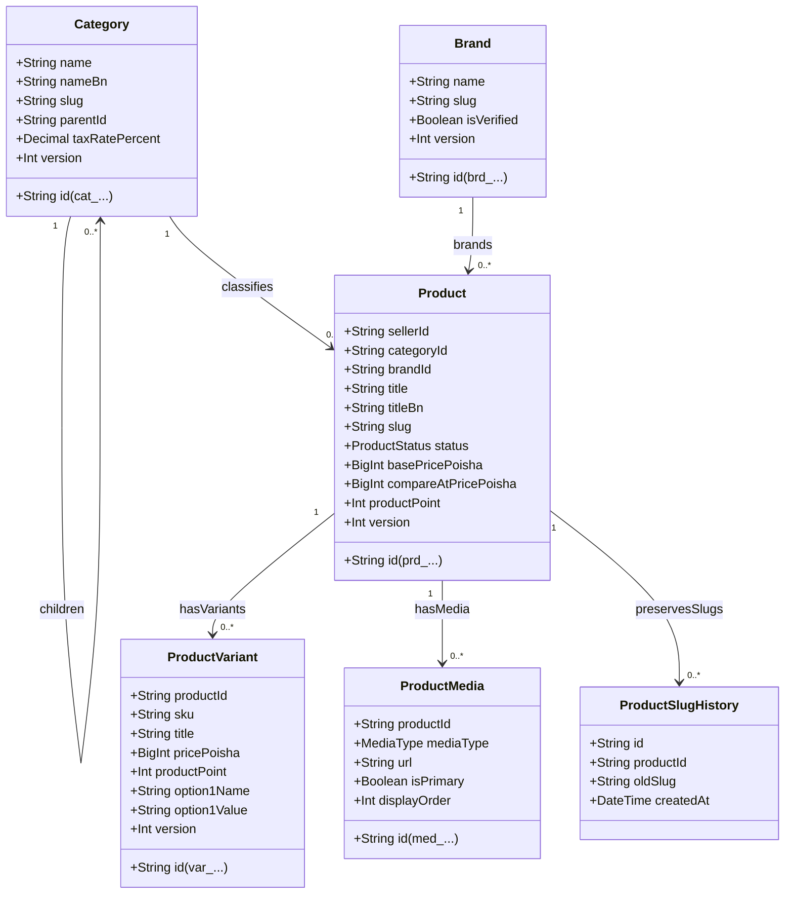

# Catalog Taxonomy, Products, Variants, and Media Architecture

**Document Type**: Architectural Specification & Domain Data Model  
**Phase Reference**: Phase 03 — Data Architecture  
**Milestone Reference**: [Milestone 025](../../AlifWorld-300-Milestones/025-model-catalog-taxonomy-products-variants-and-media.md)  
**Supporting ADR**: [ADR-0025](../decisions/0025-model-catalog-taxonomy-products-variants-and-media.md)  
**Status**: Authoritative & Accepted  

---

## 1. Domain Overview & Relational Architecture

The AlifWorld Catalog subsystem organizes multi-vendor merchant listings into a standardized national taxonomy. It enforces strict separation between **monetary price in BDT integer poisha** and **independent discrete Product Points**, provides multi-SKU variant modeling, manages permanent media assets, and guarantees SEO permalink preservation via slug history tracking.



---

## 2. Core Invariants & Financial Discipline

### 2.1 Integer Poisha Monetary Representation
- **Minor Unit Rule**: All prices (`basePricePoisha`, `compareAtPricePoisha`, `pricePoisha`) are represented as integer minor units (`1 BDT = 100 poisha`).
- **Zero Floating Point Invariant**: Calculations avoid floating-point inaccuracies by computing all tax, line discounts, and totals using integer arithmetic.

### 2.2 Independent Product Points Invariant
- **Zero Inferred Conversion Rate**: Product price and Product Points are completely independent values. A seller may set a price of ৳21,990 (2,199,000 poisha) and allocate 450 discrete Product Points. The platform never infers a monetary exchange rate between points and poisha.
- **Accrual Trigger**: Points are immutable snapshots on order line items and are credited to customer accounts only when fulfillment orders reach `COMPLETED`.

### 2.3 Optimistic Concurrency Control (OCC)
- Every model (`Category`, `Brand`, `Product`, `ProductVariant`) maintains an integer `version` incremented on each mutation. Updates verify `version === expectedVersion` before committing.

### 2.4 Soft Deletion & URL Preservation
- Products, categories, and brands follow `SOFT_DELETE`.
- When a product's public slug is modified (e.g. for marketing or title refinement), the previous slug is archived in `ProductSlugHistory`. Any request accessing the historical slug receives a permanent redirect to the current canonical URL.

---

## 3. Bangladesh Regulatory Tax Model (NBR Mushak 6.3)

Tax compliance conforms to National Board of Revenue guidelines:
- **Standard VAT Rate**: 15.00% across standard commercial retail.
- **ICT & Electronics Concession**: 5.00% reduced rate for locally assembled computer hardware, mobile phones, and electronic accessories.
- **Essential Exemption**: 0.00% VAT on basic agricultural commodities, essential grains, and educational publications.

### Tax Snapshot Contract (`TaxSnapshot`)
Each invoice or order confirmation freezes an immutable tax breakdown:
```typescript
interface TaxSnapshot {
  jurisdiction: 'BD';
  effectiveDate: string; // ISO 8601
  totalNetPoisha: number;
  totalTaxPoisha: number;
  totalGrossPoisha: number;
  lines: TaxCalculationBreakdown[];
}
```

---

## 4. Publication Readiness Verification Checklist

A product cannot transition from `DRAFT` to `PUBLISHED` unless the following 5 criteria are verified by `ProductService.publishProduct()`:
1. **Verified Category**: Assigned to an active, non-deleted `Category`.
2. **Valid Price**: `basePricePoisha > 0` (minimum 1 poisha / 0.01 BDT).
3. **Discrete Points**: `productPoint >= 0`.
4. **Media Presence**: At least one primary image asset attached in `ProductMedia`.
5. **Merchant Standing**: The owning `Seller` account is active and not in `SUSPENDED` status.

---

## 5. Event Publishing & Outbox Notifications

Catalog modifications emit transactional outbox events to BullMQ queues for Meilisearch indexing and external feeds:
- `PRODUCT_CREATED`: Emitted when a merchant initiates a product listing.
- `PRODUCT_UPDATED`: Emitted on attribute, variant, or media changes.
- `PRODUCT_PUBLISHED`: Emitted when publication checklist passes; triggers storefront search index ingestion.
- `PRODUCT_ARCHIVED`: Emitted on listing deprecation; removes item from active discovery queries.
