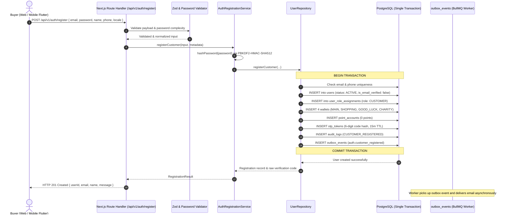

# Customer Email and Password Registration Architecture Specification

## 1. Executive Summary

Milestone 032 implements the customer registration subsystem for AlifWorld. This specification details the end-to-end architecture governing account creation, cryptographic password derivation, immediate multi-account wallet provisioning, ephemeral email verification code generation, transactional outbox dispatch, and the bilingual customer UI.

The architecture satisfies **ADR-0032**, **ADR-0003**, **ADR-0022**, **ADR-0029**, and **ADR-0031**, ensuring complete transactional consistency, zero secret exposure, and immediate availability of customer balance accounts.

---

## 2. End-to-End Registration Workflow



---

## 3. Relational Persistence & State Model

When a customer registers, 8 database entities are touched or created atomically within a single transaction:

| Entity | Primary Key / Index | Lifecycle Policy | Initial State |
|---|---|---|---|
| **`User`** | `usr_...` | `SOFT_DELETE` | `status: 'ACTIVE'`, `isEmailVerified: false`, `tokenVersion: 1` |
| **`Role`** | `rol_...` (`code: 'CUSTOMER'`) | `SOFT_DELETE` | Default customer role |
| **`UserRoleAssignment`** | `ura_...` | `SOFT_DELETE` | Binds user to `CUSTOMER` role |
| **`Wallet` (`MAIN`)** | `wal_...` | `SOFT_DELETE` | `availablePoisha: 0`, `pendingPoisha: 0`, `status: 'ACTIVE'` |
| **`Wallet` (`SHOPPING`)** | `wal_...` | `SOFT_DELETE` | `availablePoisha: 0`, `pendingPoisha: 0`, `status: 'ACTIVE'` |
| **`Wallet` (`GOOD_LUCK`)** | `wal_...` | `SOFT_DELETE` | `availablePoisha: 0`, `pendingPoisha: 0`, `status: 'ACTIVE'` |
| **`Wallet` (`CHARITY`)** | `wal_...` | `SOFT_DELETE` | `availablePoisha: 0`, `pendingPoisha: 0`, `status: 'ACTIVE'` |
| **`PointAccount`** | `pac_...` | `SOFT_DELETE` | `availablePoints: 0`, `pendingPoints: 0`, `lifetimePoints: 0` |
| **`OtpToken`** | `otp_...` | `EPHEMERAL` | 6-digit numeric hash, `purpose: 'EMAIL_VERIFICATION'`, 15m TTL |
| **`OutboxEvent`** | `evt_...` | `IMMUTABLE` | `eventType: 'auth.customer_registered'`, `status: 'PENDING'` |
| **`AuditLog`** | `aud_...` | `IMMUTABLE` | `action: 'CUSTOMER_REGISTERED'`, `resource: 'User'` |

---

## 4. Cryptographic Standards & Key Derivation

- **Hashing Algorithm**: PBKDF2-HMAC-SHA512
- **Iterations**: 100,000 iterations
- **Salt**: 32 bytes of cryptographically secure random bytes (`crypto.randomBytes(32)`)
- **Key Length**: 64 bytes
- **Comparison**: Constant-time comparison (`crypto.timingSafeEqual`) to mitigate timing side channels
- **Zero Raw Storage**: The plaintext password and raw OTP codes are never logged, persisted, or leaked in error responses

---

## 5. REST API Contract

### Request: `POST /api/v1/auth/register`
```json
{
  "name": "Tanvir Ahmed",
  "email": "tanvir@example.com",
  "phone": "01700112233",
  "password": "Dhaka@Commerce#2026!",
  "locale": "bn-BD",
  "acceptTerms": true
}
```

### Success Response: `HTTP 201 Created`
```json
{
  "success": true,
  "data": {
    "userId": "usr_1j7x4b9e8m02k3f8d7c6b5a4",
    "email": "tanvir@example.com",
    "name": "Tanvir Ahmed",
    "phone": "+8801700112233",
    "status": "ACTIVE",
    "isEmailVerified": false,
    "message": "Account registered successfully. A 6-digit verification code has been sent to your email."
  }
}
```

### Conflict Response: `HTTP 409 Conflict`
```json
{
  "success": false,
  "error": {
    "code": "CONFLICT",
    "message": "An account with email 'tanvir@example.com' already exists"
  }
}
```

### Validation Failure: `HTTP 422 Unprocessable Entity`
```json
{
  "success": false,
  "error": {
    "code": "VALIDATION_FAILED",
    "message": "Registration input validation failed",
    "details": {
      "fieldErrors": {
        "password": ["Password must contain at least one special character (!@#$%^&*...)"]
      }
    }
  }
}
```

---

## 6. Frontend Storefront Registration Architecture

- **Path**: `src/app/register/page.tsx`
- **Design System Alignment**: Dark aesthetic matching marketplace storefront theme, utilizing emerald accent highlights (`#059669`).
- **Interactive Password Meter**: Real-time evaluation of all 5 security rules with color-coded progression bar (red $\to$ yellow $\to$ green).
- **Dual-Language Localization**: Client-side toggle between Bengali (`বাংলা`) and English, dynamically updating all labels, placeholder text, validation errors, and confirmation dialogues.
- **Accessibility**: Standard HTML5 semantic landmarks, visible focus states, label-input associations, and keyboard navigability.
