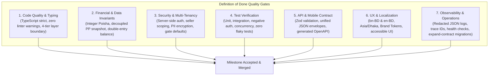

# AlifWorld Definition of Done (DoD) & Requirements Traceability Matrix (RTM)

**Document Type**: Engineering Quality Governance & Requirements Traceability Specification  
**Phase Reference**: Phase 01 — Governance and Architecture  
**Milestone Reference**: [Milestone 010](../../AlifWorld-300-Milestones/010-definition-of-done-and-requirements-traceability-matrix.md)  
**Status**: Authoritative & Mandatory  

---

## 1. Executive Summary & Purpose

Milestone 010 concludes Phase 01 (**Governance and Architecture**) by providing the two ultimate quality anchors for the entire AlifWorld project:
1. **The Canonical Definition of Done (DoD)**: The definitive, non-negotiable checklist required for every milestone, feature pull request, bug fix, and production release across the 300 milestones.
2. **The Requirements Traceability Matrix (RTM)**: The comprehensive bidirectional map linking business requirements from source documents to domain bounded contexts, architecture specifications, milestone deliveries, and verification test suites.

By establishing these two pillars, AlifWorld guarantees zero ambiguity, zero untested assumptions, and 100% compliance with business, technical, and regulatory requirements before engineering execution begins in Phase 02.

---

## 2. Canonical Definition of Done (DoD)

Every milestone across Phases 01 through 30 must satisfy the **AlifWorld Canonical Definition of Done** before being marked as completed. A milestone that satisfies functional behavior but fails any DoD criterion cannot be accepted.

### 2.1 Code Quality, Architecture & Design Standards
- [ ] **Strict TypeScript**: Code compiles with zero errors under `strict: true`. No `any`, `@ts-ignore`, or loose type casts without architectural justification.
- [ ] **Single Modular Monolith**: Code resides strictly within the single Next.js monolith repository. No external microservices or rogue backend frameworks.
- [ ] **4-Tier Architectural Layering**:
  - Route Handlers (`app/api/v1`) are thin adapters performing validation, authentication, authorization, service invocation, and serialization.
  - Domain Services (`features/<domain>/services`) own business logic, transactional invariants, and domain event publishing.
  - Repositories (`features/<domain>/repositories`) own scoped database queries and field selection.
  - Shared domain primitives reside in `src/shared/`.
- [ ] **Stateless Application**: Zero dependence on local server filesystem. All permanent assets stream to S3-compatible object storage via typed interfaces.

### 2.2 Financial & Data Integrity Invariants
- [ ] **Integer Minor Units (Poisha)**: All currency values are stored, calculated, and communicated in integer Poisha (`1 BDT = 100 poisha`). Zero floating-point arithmetic for currency.
- [ ] **Independent Product Points (PP)**: Product Price and Product Points are decoupled. Points snapshot onto order items at checkout and are credited as `productPointSnapshot * eligibleQuantity` only when the order reaches `COMPLETED` status.
- [ ] **Double-Entry Bookkeeping**: Ledger journal entries strictly balance (`SUM(debits) == SUM(credits)`). No account balance may drop below zero (`balance >= 0` check constraint).
- [ ] **Idempotency**: All mutating operations (orders, payments, payouts, point accruals, ledger postings, inventory reservations) require unique idempotency keys.
- [ ] **Historical Audit Snapshot**: Rule versions, commission percentages, and point configurations are snapshotted at transaction time. Recalculation of historical transactions is forbidden.

### 2.3 Security, Multi-Tenancy & Compliance Gates
- [ ] **Server-Side Authorization**: Hiding UI buttons is not security. Every server action and API endpoint verifies session authenticity and user role permissions.
- [ ] **Seller-Tenant Isolation**: Every database query touching seller data strictly filters by `seller_id`. Cross-tenant data leakage is verified by automated negative tests.
- [ ] **Data Protection & PII**: Passwords hashed with Argon2id / bcrypt. National ID (NID) and sensitive KYC data encrypted using AES-256-GCM envelope encryption.
- [ ] **Compliance Gate Enforcement**: Features subject to **GATE-01** through **GATE-07** are dark-launched behind feature flags with default disabled status (`FEATURE_*_ENABLED=false`). Unauthorized access yields HTTP `403` with `FEATURE_PENDING_REGULATORY_APPROVAL`.

### 2.4 Testing & Verification Suite
- [ ] **Deterministic Unit Tests**: Pure domain logic, price calculations, VAT deductions, point splits, and state machine transitions pass with 100% determinism.
- [ ] **Integration Tests**: Repositories and transactional services execute against a real isolated PostgreSQL database with rollback or truncation cleanup.
- [ ] **Negative Security Tests**: Tests explicitly verify that unauthenticated users, wrong-role users, and cross-tenant actors are rejected with `401` or `403`.
- [ ] **Concurrency & Race Condition Tests**: High-concurrency tests verify that simultaneous requests (e.g. double-spend, flash sale stock depletion) are safely serialized via pessimistic locking and unique database constraints.

### 2.5 API & Mobile Flutter Contracts
- [ ] **Unified API Response Envelopes**:
  - Success: `{ "success": true, "data": ... }`
  - Paginated: `{ "success": true, "data": [...], "pagination": { "page": 1, "limit": 20, "total": 100, "totalPages": 5, "hasNext": true, "hasPrev": false } }`
  - Error: `{ "success": false, "error": { "code": "...", "message": "...", "details": ... } }`
- [ ] **OpenAPI Generation**: OpenAPI 3.1 specifications are automatically generated from Zod validator schemas and route metadata. No manual handwritten OpenAPI divergence.
- [ ] **HTTP Semantics**: Proper use of HTTP verbs and status codes (200, 201, 400, 401, 403, 404, 409, 422, 429, 500).

### 2.6 UX, Brand Tokens & Localization
- [ ] **Brand Token Fidelity**: UI strictly adheres to authoritative brand tokens:
  - Deep Black (`#000000`), Pure White (`#FFFFFF`), Brand Orange (`#FF6A00`), Globe Blues (`#4F8FD9`, `#69B7E8`, `#3456A3`).
  - Standalone Alif globe icon mark; never substituted for the letter "O".
- [ ] **Bilingual Localization**: Interfaces and error responses support Bengali (`bn-BD`, default) and English (`en-BD`). All strings referenced via localization dictionary keys.
- [ ] **Regional Formatting**: Currencies displayed in BDT (`৳`), dates formatted in `Asia/Dhaka` timezone.
- [ ] **Accessibility & Responsiveness**: Mobile-first responsive design, semantic HTML, visible focus states, ARIA attributes, and keyboard navigation.

### 2.7 Observability, Operations & Release Safety
- [ ] **Redacted Structured Logging**: JSON logs include `requestId`, `timestamp`, `level`, `domain`, and `message`. PII, passwords, OTPs, and payment tokens are strictly redacted.
- [ ] **Asynchronous Decoupling**: Non-blocking operations (SMS, emails, push notifications, search index sync, invoice PDF generation) dispatched via BullMQ workers and transactional outbox.
- [ ] **Expand-and-Contract Migrations**: Database migrations contain zero breaking changes (`DROP COLUMN`, `RENAME COLUMN` forbidden during rollout).
- [ ] **Configuration Documentation**: Any new environment variable is added to `.env.example` with clear comments and safe default values.

---

## 3. Requirements Traceability Matrix (RTM)

The AlifWorld RTM establishes bidirectional traceability from the business requirements defined in source documents to architecture modules, milestone deliveries, and verification test categories.

### 3.1 Traceability Mapping Table

| Req ID | Requirement Description | Source Document Authority | Bounded Context / Domain | Implementing Phase & Milestones | Verification & Test Strategy |
|:---|:---|:---|:---|:---|:---|
| **REQ-01** | Multi-Tenant Seller Registration, Verification & Lifecycle | Proposal p.1-2, Master Spec §4 | `Seller` / `Tenancy` | **Phase 07**: M061–M070 | Unit test KYC validation; integration test approval workflow; negative tenant cross-access test. |
| **REQ-02** | Product Catalog Taxonomy, Categories & Media Management | Master Spec §4, Proposal p.2 | `Catalog` / `Media` | **Phase 08 & 09**: M071–M090 | Media S3 upload tests; slug uniqueness checks; category tree traversal tests. |
| **REQ-03** | Dynamic Pricing, Discounts, 15% NBR VAT & Mushak-6.3 | Proposal p.4, Master Spec §6 | `Pricing` / `Tax` | **Phase 10**: M091–M100 | Poisha rounding unit tests; Mushak-6.3 calculation tests; VAT exemption rules. |
| **REQ-04** | Multi-Warehouse Inventory, Reservations & Stock Alerts | Master Spec §5, Proposal p.3 | `Inventory` | **Phase 11**: M101–M110 | Concurrency tests for overselling; pessimistic locking verification; low-stock event triggers. |
| **REQ-05** | Storefront Discovery, Meilisearch Engine & Bangla Search | Master Spec §7 | `Search` / `Storefront` | **Phase 12**: M111–M120 | Meilisearch sync tests; boot-safe fallback to DB ILIKE; Bangla keyword stemmer tests. |
| **REQ-06** | Customer Experience, Cart, Wishlist & Saved Addresses | Proposal p.2, Master Spec §4 | `Customer` / `Cart` | **Phase 13**: M121–M130 | Guest cart merge tests; address validation with BD division/district/upazila hierarchy. |
| **REQ-07** | Checkout, Shipping Calculation & Courier Logistics | Master Spec §5, Proposal p.3 | `Checkout` / `Shipping` | **Phase 14**: M131–M140 | Delivery fee matrix tests; Pathao/RedX/Steadfast API mock adapters; address zone tests. |
| **REQ-08** | Order Lifecycle, Multi-Vendor Splits & Return Workflows | Proposal p.2-3, Master Spec §5 | `Order` / `Fulfillment` | **Phase 15**: M141–M150 | State machine transition tests; return window expiration tests; cancellation refund triggers. |
| **REQ-09** | Payment Orchestration (bKash, Nagad, SSLCommerz, COD) | Master Spec §6, Proposal p.3 | `Payment` | **Phase 16**: M151–M160 | Idempotency callback tests; signature verification; webhook replay protection; failure retries. |
| **REQ-10** | Double-Entry Wallet Ledger & Multi-Account Partitioning | Wallet Presentation, Proposal p.5 | `Wallet` / `Ledger` | **Phase 17**: M161–M170 | Invariant test: Debits == Credits; negative balance constraint tests; audit log reconciliation. |
| **REQ-11** | Independent Product Points Engine & Order Item Snapshots | Proposal p.4, Master Spec §6 | `Points` | **Phase 18**: M171–M180 | Snapshot decoupling test; post-order `COMPLETED` point allocation test; cancellation reversal test. |
| **REQ-12** | Customer Clubs (Daily, Weekly, Monthly, Yearly) & Splits | Proposal p.5-6, Customer Wallet | `Rewards` | **Phase 19**: M181–M185 | 50-20-15-5-10 pool allocation test; round-robin / equal distribution test; cadence cutoffs. |
| **REQ-13** | Customer Ranks (Bronze to Crown) & Rank Reward Invariants | Customer Rank Pres., Proposal p.7 | `Rewards` / `Customer` | **Phase 19**: M186–M190 | Qualification formula tests; cash bonus ledger credit tests; non-cash physical gift flag gating. |
| **REQ-14** | Seller Clubs (70-15-5-10 Split) & Leaderboards | Proposal p.6, Master Spec §6 | `Seller` / `Rewards` | **Phase 20**: M191–M200 | Sales volume calculation tests; 70-15-5-10 distribution tests; monthly leaderboard snapshot tests. |
| **REQ-15** | Regional Distribution, Sub-Distributor & District Franchise | Proposal p.7-8 | `Distribution` | **Phase 21**: M201–M210 | Geolocation commission mapping; district sales volume aggregation; commission ledger posting. |
| **REQ-16** | Single-Tier Affiliate Referrals (**GATE-01**) | Proposal p.8, Risk Register | `Affiliate` | **Phase 22**: M211–M215 | `MAX_AFFILIATE_DEPTH=1` enforcement; multi-tier code rejection; referral commission ledger tests. |
| **REQ-17** | Promotional Draw & Advanced Shopping (**GATE-02, 07**) | Proposal p.9-10, Alifworld.click | `Promotions` / `Gated` | **Phase 22**: M216–M220 | Gated flag verification (`403` returned); audit trail skip logging; mock admin activation screen. |
| **REQ-18** | Rider Logistics & Last-Mile Delivery App Contracts | Master Spec §8 | `Logistics` / `Rider` | **Phase 23**: M221–M230 | Rider assignment state machine; cash-on-delivery collection reconciliation; GPS tracking contract. |
| **REQ-19** | Admin Operations, Maker-Checker & Comprehensive Audit | Master Spec §9, Risk Register | `Admin` / `Audit` | **Phase 24**: M231–M240 | High-value payout dual-authorization tests; immutable audit trail logging; role permission matrix. |
| **REQ-20** | Asynchronous Workers, SMS (Greenweb) & BullMQ Events | Master Spec §10 | `Workers` / `Events` | **Phase 25**: M241–M250 | Job retry exponential backoff tests; dead-letter queue routing; SMS rate limit token bucket tests. |
| **REQ-21** | Flutter Mobile REST APIs & Generated OpenAPI Contracts | Master Spec §11 | `API` / `OpenAPI` | **Phase 26**: M251–M260 | Zod-to-OpenAPI schema diff tests; Flutter client payload validation; Bearer token authentication. |
| **REQ-22** | High-Availability, 99.95% SLOs & Sub-100ms Latencies | NFR Specification, SLO Doc | `Infra` / `SRE` | **Phase 27**: M261–M270 | K6 load test scenarios; Redis cache hit ratio verification; database connection pool stress test. |
| **REQ-23** | Bangladesh Localization (`bn-BD`, `en-BD`, Asia/Dhaka) | Master Spec §3, Glossary Doc | `Localization` | **Phase 06 & 28**: M051–M060, M271 | Bilingual string lookup tests; Asia/Dhaka midnight cutoff tests; BDT currency formatting tests. |
| **REQ-24** | Security Hardening, Penetration Testing & Data Sovereignty | Master Spec §12, Risk Register | `Security` | **Phase 28**: M271–M280 | OWASP Top 10 automated scan; SQL injection tests; rate limit threshold tests; NID encryption tests. |
| **REQ-25** | Zero-Downtime CI/CD, Rolling Release & Production Runbook | Release Strategy Doc, Charter | `DevOps` / `Release` | **Phase 29 & 30**: M281–M300 | Health check probe tests; graceful shutdown verification; Expand-and-Contract migration dry runs. |

---

## 4. Quality Governance & Phase Transition Rules

### 4.1 Phase Transition Acceptance Criteria
A phase cannot transition to the next phase in the 30-phase roadmap unless:
1. **100% Milestone Completion**: Every milestone in the phase has `status: completed` and all acceptance criteria checked.
2. **Zero Open Quality Defects**: No open P0 or P1 bugs in the phase scope.
3. **Traceability Verification**: All requirements assigned to the phase have verified implementations and automated test suites mapped in the RTM.
4. **Clean Code Quality**: Linting, type checking, test suite, and build checks pass with zero warnings or errors.
5. **Architectural Consistency**: All design changes are reflected in accepted ADRs in `docs/decisions/`.

### 4.2 AI Execution Enforcement
When an autonomous AI agent executes a milestone:
1. **Pre-Implementation Check**: The agent must verify that all predecessor milestones in the DAG are completed.
2. **DoD Compliance Verification**: The agent must evaluate its deliverables against Section 2 (Canonical DoD) before claiming milestone completion.
3. **No Speculative Extensions**: The agent is forbidden from adding unauthorized fields or creating unapproved financial behaviors not documented in the RTM.
