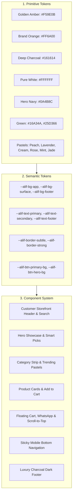

# AlifWorld Design System & Brand Tokens Specification

**Document Type**: Visual Identity, Design Token Architecture & UI Component System  
**Phase Reference**: Phase 02 — Repository and Tooling  
**Milestone Reference**: Milestone 014  
**Status**: Authoritative & Mandatory  

---

## 1. Brand Identity Authority & Visual Foundations

The AlifWorld visual identity is anchored directly in the updated brand specification ([`colors.md`](../../colors.md)), the official logo asset ([`logo.png`](../../logo.png)), and customer storefront UI references. It reflects an intuitive, high-conversion modern customer storefront built for nationwide e-commerce.

### 1.1 Authoritative Color Palette
The platform enforces a locked palette across Web, Customer Storefront, and Mobile clients:

```
[#F59E0B] Golden Amber     - Primary interactive CTAs (Add to cart), See All links, ratings
[#FF6A00] Brand Orange     - Brand logo smile curve, active tab indicators, accents
[#161614] Deep Charcoal    - Luxury dark footer foundation, dark surface containers
[#18181B] Charcoal Black   - Floating cart button, card headlines
[#FFFFFF] Pure White       - Primary product cards, search inputs, dialogs
[#FAF9F6] Canvas Cream     - Storefront page background
[#0A4B8C] Hero Deep Navy   - Hero primary action ("Explore Now >")
[#E0F2FE] Sky Wash Tint    - Header atmosphere and top bar wash
[#16A34A] In-Stock Green   - Live stock indicator (● In Stock) and savings tags
[#25D366] WhatsApp Green   - Floating direct customer support button
```

### 1.2 Globe Logo Governance Rules
- **Rule 1 (Standalone Trademark)**: The 3D globe icon is an independent brand mark.
- **Rule 2 (No Letter Substitution)**: The globe icon must **never** be used as a substitute for the letter "O" in "ALIFWORLD".
- **Rule 3 (Clear Space)**: The logo requires a minimum clear breathing margin equal to 50% of the globe diameter on all sides.

---

## 2. Design Token Architecture



---

## 3. WCAG 2.1 Accessibility & Contrast Standards

AlifWorld targets **WCAG 2.1 AA and AAA** compliance:

| Foreground Color | Background Surface | Contrast Ratio | WCAG 2.1 Level | Usage Context |
|:---|:---|:---|:---|:---|
| **Pure Black** (`#000000`) | Golden Amber (`#F59E0B`) | **8.5 : 1** | **AAA** | Primary `Add to cart` button text |
| **Pure White** (`#FFFFFF`) | Hero Navy (`#0A4B8C`) | **9.2 : 1** | **AAA** | Hero `Explore Now >` button text |
| **Pure White** (`#FFFFFF`) | Deep Charcoal (`#161614`) | **19.5 : 1** | **AAA** | Footer headings, contact text |
| **Slate Primary** (`#0F172A`) | Pure White (`#FFFFFF`) | **18.8 : 1** | **AAA** | Product title, section titles |
| **In-Stock Green** (`#16A34A`) | Pure White (`#FFFFFF`) | **4.8 : 1** | **AA** | In-stock inventory indicators |
