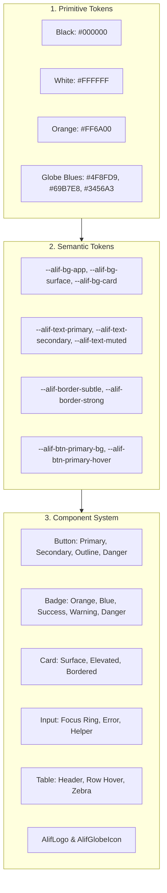

# AlifWorld Design System & Brand Tokens Specification

**Document Type**: Visual Identity, Design Token Architecture & UI Component System  
**Phase Reference**: Phase 02 — Repository and Tooling  
**Milestone Reference**: [Milestone 014](../../AlifWorld-300-Milestones/014-create-the-alifworld-design-system-and-brand-tokens.md)  
**Status**: Authoritative & Mandatory  

---

## 1. Brand Identity Authority & Visual Foundations

The AlifWorld visual identity is anchored directly in the authoritative brand specification ([`colors.md`](../../colors.md)) and the official logo asset ([`logo.png`](../../logo.png)). It reflects an enterprise-grade, high-trust multi-vendor e-commerce platform built for Bangladesh with a modern, high-contrast dark foundation.

### 1.1 Authoritative Color Palette
The platform enforces a locked palette across Web, Admin, Seller, and Mobile Flutter interfaces:

```
[#000000] Deep Black      - Core canvas, root backgrounds, headers, footers
[#FFFFFF] Pure White      - Primary text, high-contrast typography, cards
[#FF6A00] Brand Orange    - Primary interactive CTAs, active states, accents
[#4F8FD9] Globe Blue      - Standalone globe primary body, secondary brand accent
[#69B7E8] Globe LightBlue - Globe specular highlight, rings, elevation
[#3456A3] Globe DarkBlue  - Globe shadow, 3D spherical depth, active borders
```

### 1.2 Globe Logo Governance Rules
- **Rule 1 (Standalone Trademark)**: The 3D globe icon is an independent brand mark.
- **Rule 2 (No Letter Substitution)**: The globe icon must **never** be used as a substitute for the letter "O" in "ALIFWORLD". The canonical wordmark is always spelled with standard typography: **ALIFWORLD** (or **ALIF** in white, **WORLD** in brand orange).
- **Rule 3 (Clear Space)**: The logo requires a minimum clear breathing margin equal to 50% of the globe diameter on all sides.

---

## 2. Design Token Architecture

AlifWorld organizes design tokens into three hierarchical layers:
1. **Primitive Tokens**: Literal raw color hex codes, font weights, and spacing units.
2. **Semantic Tokens**: Contextual mappings for backgrounds, text, borders, and interactive states.
3. **Component Tokens**: Component-scoped styles for Buttons, Badges, Cards, Inputs, and Tables.



### 2.1 CSS Custom Properties ([`src/styles/tokens.css`](../../src/styles/tokens.css))
All design tokens are exposed as native CSS variables, ensuring zero-runtime theme availability across both Server Components and Client Components.

---

## 3. WCAG 2.1 Accessibility & Contrast Standards

AlifWorld targets **WCAG 2.1 AA and AAA** compliance across all customer and operational surfaces.

| Foreground Color | Background Surface | Contrast Ratio | WCAG 2.1 Level | Usage Context |
|:---|:---|:---|:---|:---|
| **Pure White** (`#FFFFFF`) | Deep Black (`#000000`) | **21.0 : 1** | **AAA** | Primary headings, body copy, icons |
| **Brand Orange** (`#FF6A00`) | Deep Black (`#000000`) | **8.5 : 1** | **AAA** | Primary CTA text, highlight badges, active links |
| **Deep Black** (`#000000`) | Brand Orange (`#FF6A00`) | **8.5 : 1** | **AAA** | Primary CTA button label text |
| **Secondary Gray** (`#A0A0A0`) | Deep Black (`#000000`) | **7.3 : 1** | **AAA** | Secondary descriptions, timestamps, subheaders |
| **Muted Gray** (`#707070`) | Deep Black (`#000000`) | **4.6 : 1** | **AA** | Breadcrumbs, helper hints, inactive icons |
| **Emerald Light** (`#34D399`) | Emerald Dark (`#022C22`) | **8.2 : 1** | **AAA** | Success badges, verified statuses, payment confirmations |
| **Amber Light** (`#FCD34D`) | Amber Dark (`#451A03`) | **9.1 : 1** | **AAA** | Warning badges, pending verification pills |
| **Red Light** (`#F87171`) | Red Dark (`#450A0A`) | **7.8 : 1** | **AAA** | Error messages, danger badges, failed attempts |

---

## 4. Typography & Bilingual Font Stack

To ensure seamless rendering of both English (`en-BD`) and Bengali (`bn-BD`), the design system uses a fallbacked font stack prioritizing native Bengali script shaping:

```css
font-family: 
  /* System UI & Modern English */
  system-ui, -apple-system, BlinkMacSystemFont, 'Segoe UI', Roboto,
  /* Bengali Specific Web & OS Fonts */
  'Tiro Bangla', 'SolaimanLipi', 'Kalpurush', 'Hind Siliguri', 'Vrinda',
  /* General Fallbacks */
  sans-serif;
```

- **Monospace Stack**: `ui-monospace, SFMono-Regular, Menlo, Monaco, Consolas, monospace` is strictly used for order numbers, transaction IDs, Poisha arithmetic displays, and KYC hashes.

---

## 5. Standard Component Library ([`src/components/ui/`](../../src/components/ui/))

### 5.1 Button Component ([`src/components/ui/button.tsx`](../../src/components/ui/button.tsx))
- `primary`: Background `#FF6A00`, text `#000000`, bold typography, orange specular glow on hover.
- `secondary`: Dark neutral background `#262626`, text `#FFFFFF`.
- `outline`: Transparent background, subtle border `#404040`, text `#FFFFFF`.
- `danger`: Red background `#DC2626`, text `#FFFFFF`, red drop shadow.
- Accessibility: Focus rings with visible focus offset (`focus:ring-2 focus:ring-brand-orangeFocus`).

### 5.2 Badge Component ([`src/components/ui/badge.tsx`](../../src/components/ui/badge.tsx))
- Semantic color variants: `default`, `orange`, `blue`, `success`, `warning`, `danger`, `outline`.
- Encapsulates high-contrast text against dark translucent tinted backgrounds (`bg-*-950/80`).

### 5.3 Card Component ([`src/components/ui/card.tsx`](../../src/components/ui/card.tsx))
- Default: `bg-neutral-900/40 border border-neutral-800 backdrop-blur-sm`.
- Elevated: `bg-neutral-900 shadow-xl border border-neutral-800`.

### 5.4 Input Component ([`src/components/ui/input.tsx`](../../src/components/ui/input.tsx))
- Dark surface `#181818`, focus ring `#FF6A00` with 30% opacity glow, explicit label mapping via `htmlFor`, inline validation error display.

### 5.5 Data Table Component ([`src/components/ui/table.tsx`](../../src/components/ui/table.tsx))
- Responsive horizontal scroll wrapper, distinct dark header row (`bg-neutral-900/70`), and row hover states for tabular data.

### 5.6 Brand Logo Component ([`src/components/brand/logo.tsx`](../../src/components/brand/logo.tsx))
- Vector SVG globe rendering with latitude/longitude meridians and 3D gradient depth.
- Standard wordmark with "ALIF" in white and "WORLD" in brand orange.

---

## 6. Flutter Mobile Token Synchronization Contract

In Phase 26, the Flutter mobile application will import these design tokens directly from a generated Dart constant class (`alif_brand_colors.dart`) synchronized from `src/shared/constants/brand-colors.ts`, ensuring 100% brand consistency between web and mobile native surfaces.
