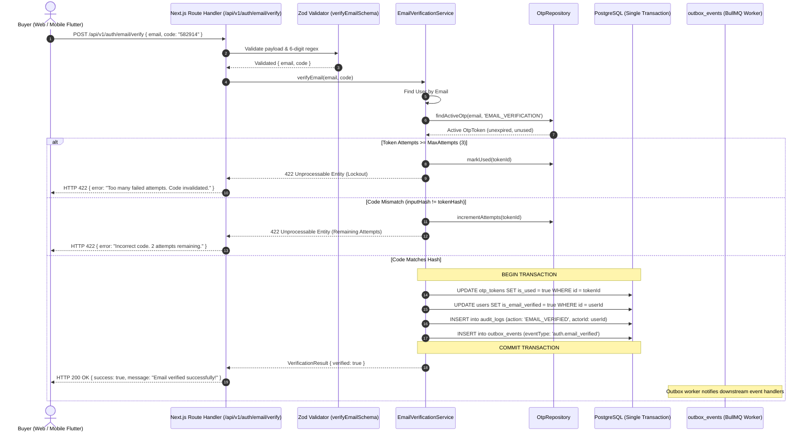
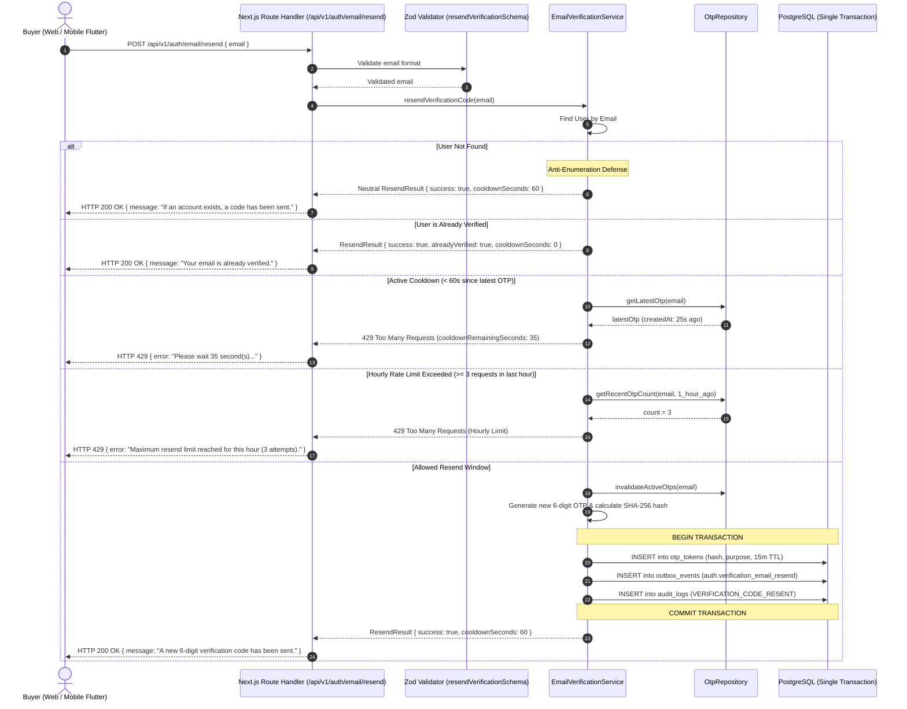
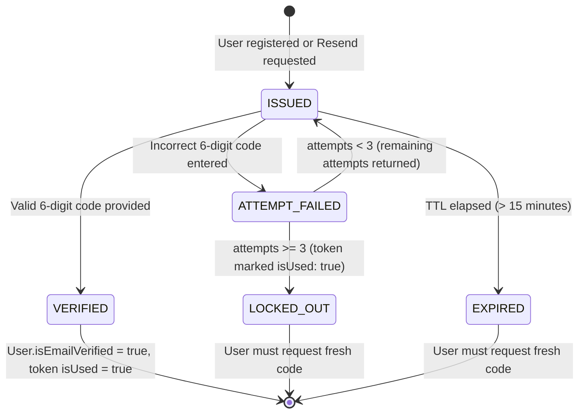

# Customer Email Verification & Resend Controls Architecture Specification

## 1. Executive Summary

Milestone 033 implements the customer email verification and resend controls subsystem for AlifWorld. This specification details the end-to-end architecture governing 6-digit numeric OTP code validation, brute-force attempt limits (max 3 failed attempts), 60-second resend cooldowns, hourly rate limits (max 3 requests/hour), anti-enumeration defense, atomic database transactions, and the bilingual customer UI.

The architecture satisfies **ADR-0033**, **ADR-0022**, **ADR-0031**, and **ADR-0032**, ensuring defense against automated brute force, protection of email sending quotas, and seamless customer onboarding.

---

## 2. End-to-End Verification & Resend Workflows

### 2.1 Verification Sequence



### 2.2 Resend & Rate Limiting Sequence



---

## 3. State & Lifecycle Rules



---

## 4. Security & Cryptographic Invariants

1. **SHA-256 Token Hashing**: Ephemeral 6-digit codes are hashed via `hashToken()` (SHA-256) before persistence. Cleartext codes are never stored in the database.
2. **Brute Force Defense**: With 10^6 code combinations, a 3-attempt ceiling restricts the attack probability per code to 0.0003% (3 in 1,000,000).
3. **Anti-Enumeration Neutral Envelope**: `resendVerificationCode` returns an identical success envelope with a 60-second cooldown whether or not the account exists.
4. **Strict Cooldown Enforcement**: Prevents rapid automated API requests by enforcing 60 seconds between OTP generations per identifier.
5. **Hourly Ceiling (Cost and Spam Protection)**: Prevents email fatigue and malicious resource consumption by locking resends at 3 per rolling hour.
6. **Atomic Transaction**: Ensures `isEmailVerified` cannot be set without consuming the OTP token, recording an audit log, and emitting an outbox event.

---

## 5. REST API Specifications

### 5.1 Verify Email Endpoint

- **Method & Route**: `POST /api/v1/auth/email/verify`
- **Request Body**:
  ```json
  {
    "email": "tanvir@example.com",
    "code": "582914"
  }
  ```
- **Responses**:
  - `HTTP 200 OK`:
    ```json
    {
      "success": true,
      "data": {
        "verified": true,
        "email": "tanvir@example.com",
        "userId": "usr_01j7x4b9e8m02k3f8d7c6b5a1",
        "message": "Email verified successfully! You can now log in to your AlifWorld account."
      }
    }
    ```
  - `HTTP 422 Unprocessable Entity` (Wrong code with attempts remaining):
    ```json
    {
      "success": false,
      "error": {
        "code": "VALIDATION_FAILED",
        "message": "Incorrect verification code. You have 2 attempt(s) remaining.",
        "details": { "remainingAttempts": 2 }
      }
    }
    ```
  - `HTTP 422 Unprocessable Entity` (Max attempts reached / Lockout):
    ```json
    {
      "success": false,
      "error": {
        "code": "VALIDATION_FAILED",
        "message": "Incorrect verification code. Maximum attempts reached. Please request a new code.",
        "details": { "remainingAttempts": 0 }
      }
    }
    ```

### 5.2 Resend Verification Endpoint

- **Method & Route**: `POST /api/v1/auth/email/resend`
- **Request Body**:
  ```json
  {
    "email": "tanvir@example.com"
  }
  ```
- **Responses**:
  - `HTTP 200 OK`:
    ```json
    {
      "success": true,
      "data": {
        "success": true,
        "message": "A new 6-digit verification code has been sent to your email.",
        "cooldownSeconds": 60
      }
    }
    ```
  - `HTTP 429 Too Many Requests` (Active cooldown):
    ```json
    {
      "success": false,
      "error": {
        "code": "VALIDATION_FAILED",
        "message": "Please wait 42 second(s) before requesting another code.",
        "details": { "cooldownRemainingSeconds": 42 }
      }
    }
    ```
  - `HTTP 429 Too Many Requests` (Hourly limit):
    ```json
    {
      "success": false,
      "error": {
        "code": "VALIDATION_FAILED",
        "message": "Maximum resend limit reached for this hour (3 attempts). Please try again later or contact support.",
        "details": { "maxPerHour": 3 }
      }
    }
    ```

---

## 6. Bilingual Storefront Interface (`/verify-email`)

The verification interface is built as a dark-theme, responsive Next.js client component:
- **6-Digit PIN Input**: Renders 6 separate inputs with single-digit masking, automatic focus shift on typing, and backwards focus shift on backspace.
- **Clipboard Handling**: Detects paste events on any of the cells, extracts first 6 numeric characters, distributes them across inputs, and shifts focus to the final input cell.
- **Interactive 60s Countdown Timer**: Tracks remaining cooldown seconds in real-time, disabling the Resend button until the countdown completes.
- **Bilingual Localization**: Supports instant toggling between Bengali (`bn-BD`) and English (`en-BD`) with localized copy, labels, and error messages.
- **Visual Feedback**: Outlines invalid inputs in red on failure, animates loading spinners during verification, and shows a celebratory green success card redirecting to the login screen.
