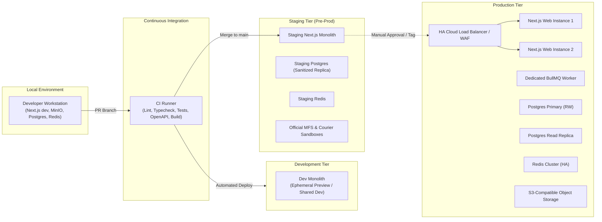
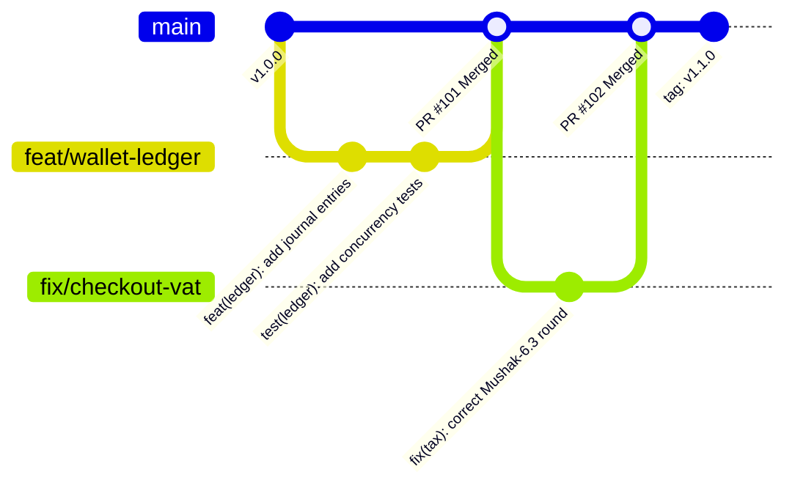
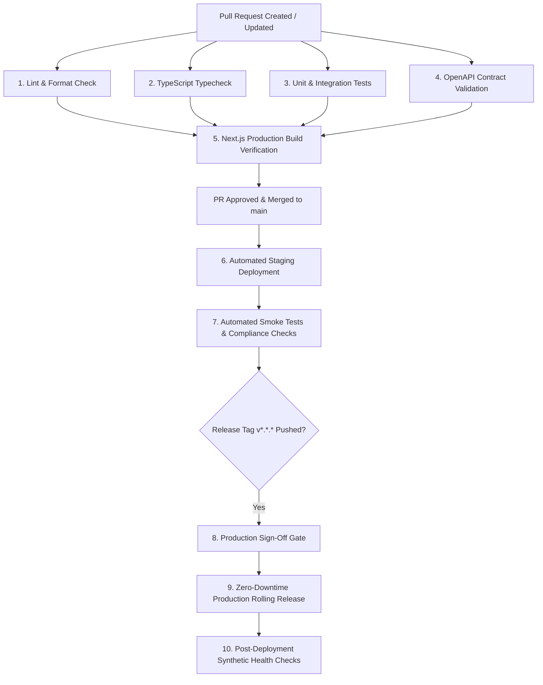
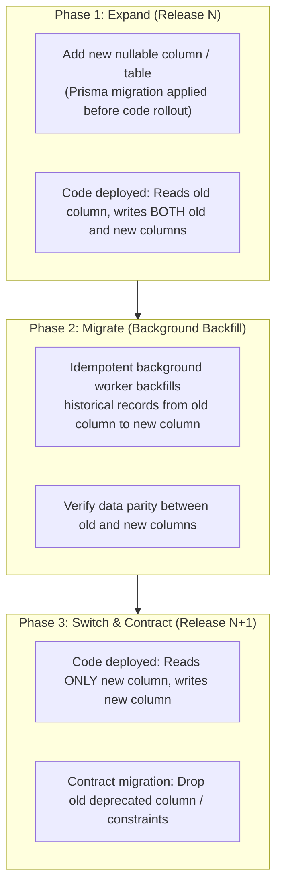

# AlifWorld Environment, Branching, and Release Strategy

**Document Type**: Architectural Specification & Operational Delivery Protocol  
**Phase Reference**: Phase 01 — Governance and Architecture  
**Milestone Reference**: [Milestone 009](../../AlifWorld-300-Milestones/009-environment-branching-and-release-strategy.md)  
**Status**: Authoritative & Mandatory  

---

## 1. Executive Summary & Core Principles

AlifWorld is architected as a single-codebase, single-deployable Next.js modular monolith serving the Storefront, Admin Panel, Seller Center, REST API (`/app/api/v1`), and asynchronous BullMQ background workers. 

To maintain high availability, data integrity across transactional ledgers, and absolute compliance with Bangladesh regulatory requirements, the platform enforces:
1. **Immutable Artifact Deployments**: The exact same containerized Next.js monolith artifact built in CI is promoted across Staging and Production. Configuration is injected strictly via environment variables at runtime.
2. **Zero-Downtime Releases**: Blue/Green or Rolling canary deployments ensure active customer sessions, cart checkouts, and ledger postings continue uninterrupted during releases.
3. **Decoupled Deployment and Release**: Deploying code does not mean releasing features. Capabilities—especially those subject to compliance approval gates (GATE-01 to GATE-07)—are dark-launched and controlled via feature flags and versioned configuration.
4. **Expand-and-Contract Database Migrations**: Schema evolution is strictly additive during code deployment. Breaking or destructive operations are separated into phased migrations to ensure 100% backward and forward compatibility.
5. **Trunk-Based Development (TBD)**: Short-lived feature branches (< 48 hours) merge into a single `main` trunk via passing automated CI verification and code reviews.

---

## 2. Environment Topology & Infrastructure Matrix

AlifWorld defines four discrete runtime tiers: **Local**, **Development**, **Staging**, and **Production**.



### 2.1 Detailed Environment Comparison

| Dimension | Local (`local`) | Development (`development`) | Staging (`staging`) | Production (`production`) |
|:---|:---|:---|:---|:---|
| **Purpose** | Day-to-day engineering and unit/integration testing | Branch preview, exploratory QA, collaborative integration | High-fidelity pre-production, UAT, load testing, compliance sign-off | Live commercial operations in Bangladesh |
| **Monolith Topology** | Single process (Next.js dev server, Bun / Node) | Single container instance / Ephemeral branch preview | Single/Multi-instance container behind load balancer | Multi-instance stateless Next.js web instances + dedicated BullMQ workers |
| **Database** | Local Docker PostgreSQL 16 | Shared Managed PostgreSQL (dev instance) | Managed PostgreSQL mirroring production sizing (anonymized data) | High-Availability Managed PostgreSQL 16 with Primary (RW) + Read Replicas + Connection Pooling |
| **Cache & Queues** | Local Docker Redis 7 | Shared Redis (dev) | Managed Redis (single node with persistence) | High-Availability Redis Cluster / Sentinel with in-memory persistence |
| **Search Engine** | Local Meilisearch (boot-safe fallback to DB ILIKE) | Hosted Meilisearch dev | Hosted Meilisearch staging | Multi-node Meilisearch cluster with boot-safe DB fallback |
| **Object Storage** | Local MinIO / Mock File Adapter | S3 Dev Bucket | S3 Staging Bucket (CDN enabled) | S3 Production Bucket (Enterprise CDN, SSE-S3 encryption, strict CORS) |
| **MFS Gateways** | Deterministic local mock responses | Sandbox / Mock | Official bKash / Nagad / SSLCommerz Sandbox | Live Bangladesh MFS & Payment Gateway production endpoints |
| **Logistics / Courier** | Mock courier API responses | Sandbox / Mock | Official Pathao / RedX / Steadfast Sandbox | Live Production Courier APIs with automated webhook verification |
| **SMS / OTP** | Mock console logger / static test OTPs | Twilio / Greenweb Test Sandbox | Greenweb / Twilio Staging Sandbox | Production SMS Gateway (Greenweb Bangladesh, Twilio fallback) with token bucket rate limits |
| **Feature Flags** | Developer `.env.local` toggles | Dev feature matrix | Enforced compliance gate testing | Default disabled for ungated features (`FEATURE_*_ENABLED=false`) |
| **Observability** | Console stdout, pretty pino logs | Structured JSON logs | Structured JSON, OpenTelemetry tracing, Sentry Staging | OpenTelemetry, Prometheus metrics, Sentry Production, CloudWatch / Datadog audit logs |

---

## 3. Branching Strategy: Trunk-Based Development (TBD)

AlifWorld follows **Trunk-Based Development** with short-lived feature branches to eliminate merge debt and ensure continuous deployment readiness.



### 3.1 Branch Naming Taxonomy
All branches cut from `main` must follow standard prefixes:
- `feat/<domain>-<short-description>`: New functional capabilities (e.g., `feat/seller-kyc-upload`, `feat/ledger-reconciliation`).
- `fix/<domain>-<short-description>`: Bug and defect remediations (e.g., `fix/poisha-rounding-edge-case`).
- `chore/<short-description>`: Tooling, dependency updates, and configuration adjustments (e.g., `chore/bump-prisma-version`).
- `docs/<short-description>`: Architectural and operational documentation updates (e.g., `docs/update-threat-model`).
- `refactor/<domain>-<short-description>`: Code structure improvements without functional behavior modification.
- `perf/<domain>-<short-description>`: Performance and query optimization changes.
- `hotfix/<short-description>`: Urgent production remediations cut from release tags.

### 3.2 Branch Lifecycle & Pull Request (PR) Governance
1. **Lifespan Limit**: Feature branches must remain active for no longer than **48 hours**. Long-running branches must be split into incremental dark-launched PRs.
2. **Rebase Before Merge**: Branches must rebase onto the latest `main` branch before PR merge to ensure linear git history and avoid merge conflicts.
3. **Automated CI Gates**: A pull request cannot be merged unless all automated checks pass:
   - `bun run lint`: ESLint passes with zero warnings.
   - `bun run typecheck`: TypeScript compiles with zero errors under strict mode.
   - `bun run test`: Unit and integration test suites pass (100% pass rate).
   - `bun run openapi:verify`: OpenAPI specs generated from Zod match route definitions.
   - `bun run build`: Production Next.js build completes successfully without errors.
4. **Code Review & Ownership**: Minimum 1 senior architectural peer approval required. Financial ledger, wallet, and authentication changes require designated domain lead review.
5. **Merge Method**: **Squash and Merge** or **Rebase and Merge** only. Merge commits into `main` are disallowed.
6. **Commit Message Standard**: Enforces the **Conventional Commits** specification:
   ```
   <type>(<optional scope>): <description>

   [optional body]

   [optional footer(s) / BREAKING CHANGE]
   ```
   *Examples*:
   - `feat(wallet): implement double-entry journal posting with pessimistic lock`
   - `fix(pricing): prevent negative poisha discount values during coupon calculation`

---

## 4. Release Strategy & CI/CD Pipeline

Releases follow **Semantic Versioning 2.0.0** (`vMAJOR.MINOR.PATCH`):
- **MAJOR**: Incompatible API breaking changes, fundamental domain schema restructuring.
- **MINOR**: Backward-compatible new features, new domain modules, new endpoints.
- **PATCH**: Backward-compatible bug fixes, security remediations, performance enhancements.

### 4.1 CI/CD Automated Workflow Stages



1. **Validation (PR Time)**: Fast feedback loop (< 5 minutes) covering static analysis, type checking, unit tests, and build verification.
2. **Staging Continuous Delivery (Merge to `main`)**: Merges to `main` trigger an automated build and container push to Staging.
3. **Staging Smoke & Compliance Verification**: Automated health checks, database migration tests, and endpoint smoke tests run against the live Staging instance.
4. **Production Release Gate**: Production deployments are triggered by creating an annotated git tag (e.g., `git tag -a v1.2.0 -m "Release v1.2.0"`). Requires authorization from Release Engineering / Operations.
5. **Zero-Downtime Rollout**: Blue/Green or Rolling canary update where new instances boot, pass readiness probes, and incrementally accept traffic.
6. **Post-Deployment Synthetic Verification**: Automated synthetic transactions test `/api/health/ready` and key non-mutating endpoints.

---

## 5. Zero-Downtime Deployment & Health Check Protocol

To ensure seamless shopping, checkout, and seller operations during releases, AlifWorld employs zero-downtime deployment practices.

### 5.1 Health Check Endpoints
The Next.js monolith exposes two standardized health endpoints under `/api/health`:
1. **Liveness Probe (`/api/health/live`)**:
   - Confirms the Node.js/Next.js process is active and accepting HTTP requests.
   - Does not query external dependencies. Returns `200 OK` with `{ "status": "alive", "timestamp": "..." }`.
   - Used by Kubernetes / load balancers to detect process crashes and restart containers.
2. **Readiness Probe (`/api/health/ready`)**:
   - Confirms deep connectivity to mandatory infrastructure:
     - PostgreSQL database connection pool check (`SELECT 1;`).
     - Prisma pending migration check (verifies no unapplied migrations).
     - Redis ping check (`PING` -> `PONG`).
   - If all dependencies respond within timeout limits, returns `200 OK` with `{ "status": "ready", "checks": { "db": "up", "redis": "up", "migrations": "synced" } }`.
   - If any core dependency fails, returns `503 Service Unavailable` with detailed internal diagnostics.
   - Traffic is not routed to a booting container until `/api/health/ready` returns `200 OK`.

### 5.2 Graceful Shutdown & Process Termination (`SIGTERM`)
When an instance is replaced during a rolling release:
1. Orchestrator issues `SIGTERM` to the container process.
2. The instance immediately marks `/api/health/ready` as failing (`503`), signaling load balancers to cease sending new incoming requests.
3. The instance keeps its HTTP server open for a **30-second drain period** to complete in-flight transactions, checkouts, and API calls.
4. Dedicated BullMQ worker processes pause queue consumption (`worker.pause()`), complete currently processing jobs, and disconnect gracefully from Redis and PostgreSQL.
5. Once active requests and jobs reach zero (or the 30-second timeout elapses), the process closes database pools and exits with status `0`.

---

## 6. Database Migration Strategy: Expand-and-Contract Pattern

Database migrations in a zero-downtime architecture must be backward-compatible so that both **Version N** (old code) and **Version N+1** (new code) can operate against the database concurrently during rolling deployments.



### 6.1 Prohibited Destructive Operations in Production Migrations
The following operations are strictly forbidden in a single-step release:
- ❌ **`DROP COLUMN`**: Breaks Version N instances immediately if they are still processing requests.
- ❌ **`RENAME COLUMN`**: Causes instant runtime query errors on unmigrated instances.
- ❌ **Adding a `NOT NULL` column without a default value**: Fails whenever Version N inserts records without the new field.
- ❌ **Modifying column data types destructively**: Incompatible serialization crashes active code.

### 6.2 Mandatory Migration Protocol
1. **Step 1 (Expand)**: Add the new column as `NULL` or with a safe database-level default. Deploy new code that writes to both the old and new columns.
2. **Step 2 (Backfill)**: Run an idempotent BullMQ background job in off-peak hours to backfill historical rows.
3. **Step 3 (Contract)**: In a subsequent scheduled release (after verifying 100% data consistency), update code to read exclusively from the new column, make the new column `NOT NULL` if required, and drop the legacy column.

---

## 7. Feature Flags & Compliance Gate Decoupling

To safeguard AlifWorld against regulatory breaches, incomplete features, and third-party downtime, all sensitive capabilities are dark-launched behind explicit feature flags.

### 7.1 Compliance Gate Mapping

| Feature Flag | Default Value | Gate Reference | Gated Domain & Impact |
|:---|:---|:---|:---|
| `FEATURE_AFFILIATE_MULTI_TIER_ENABLED` | `false` | **GATE-01** | Locks referral rewards strictly to single-tier (`MAX_AFFILIATE_DEPTH=1`). Prevents illegal MLM classification under Bangladesh Direct Selling law. |
| `FEATURE_LOTTERY_ENABLED` | `false` | **GATE-02** | Disables Good-Luck Lottery and raffle draws pending Bangladesh gaming license. Returns `403` with `FEATURE_PENDING_REGULATORY_APPROVAL`. |
| `FEATURE_MFS_DIRECT_DEBIT_ENABLED` | `false` | **GATE-03** | Disables tokenized recurring MFS billing until PCI-DSS & Bangladesh Bank PSO certification is achieved. |
| `FEATURE_NBR_TAX_INTEGRATION_ENABLED` | `false` | **GATE-04** | Controls automated Mushak-6.3 NBR submission. If disabled or offline, holds orders in `PENDING_TAX_INVOICE`. |
| `FEATURE_MAKER_CHECKER_PAYOUT_ENABLED`| `true` | **GATE-05** | Enforces dual-operator authorization for seller payouts >= 50,000 BDT. Cannot be disabled in production. |
| `FEATURE_POINTS_CASH_CONVERTIBLE` | `false` | **GATE-06** | Hard-locked to `false`. Product Points are non-convertible promotional loyalty units, completely decoupled from cash. |
| `FEATURE_ADVANCED_SHOPPING_ENABLED` | `false` | **GATE-07** | Hard-locked to `false`. Advanced Shopping deposit products disabled pending Bangladesh Bank non-banking financial clearance. |

### 7.2 Dynamic Flag Evaluation
- Feature flags are resolved via typed environment configuration at startup, with dynamic overrides loaded from the `SystemConfiguration` database table for live operations.
- Gated API endpoints return HTTP `403 Forbidden` with machine code `FEATURE_PENDING_REGULATORY_APPROVAL` when an unauthorized or unapproved feature is accessed.

---

## 8. Emergency Rollback & Incident Hotfix Procedures

### 8.1 Fast Code Rollback (< 2 Minutes)
Because application builds are immutable container images and database schema updates adhere strictly to the Expand-and-Contract model, rolling back an errant deployment does not corrupt database state:
1. Trigger load balancer traffic rerouting to the previous known-good deployment container image.
2. In-flight connections gracefully terminate; previous container instances immediately resume serving 100% of user traffic.
3. Post-rollback validation tests run against `/api/health/ready`.

### 8.2 Production Hotfix Protocol
For critical production incidents (P0/P1) that cannot be resolved via feature flag disablement:
1. Create a hotfix branch directly from the production release tag: `git checkout -b hotfix/<incident-id> v1.2.0`.
2. Apply the minimal surgical fix and add regression test coverage.
3. Run local tests: `bun run test` and `bun run build`.
4. Open an expedited Hotfix PR to `main` with the tag `HOTFIX: URGENT`.
5. Requires fast-track review from the Lead Architect and Security Lead.
6. Once CI passes and PR is merged, tag a patch release (e.g., `v1.2.1`), which deploys automatically to Staging and promotes immediately to Production after synthetic validation.
