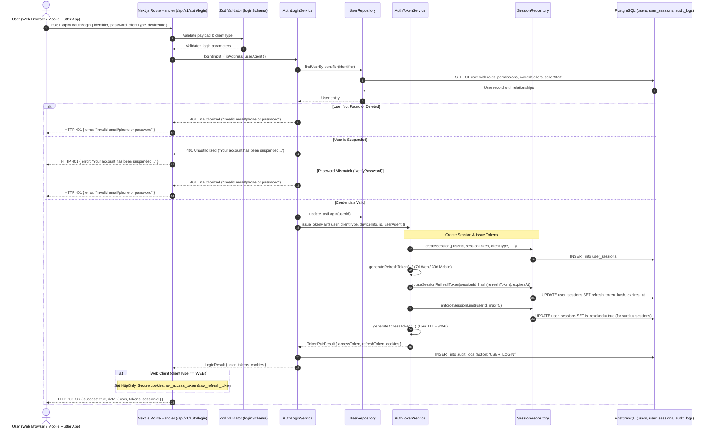
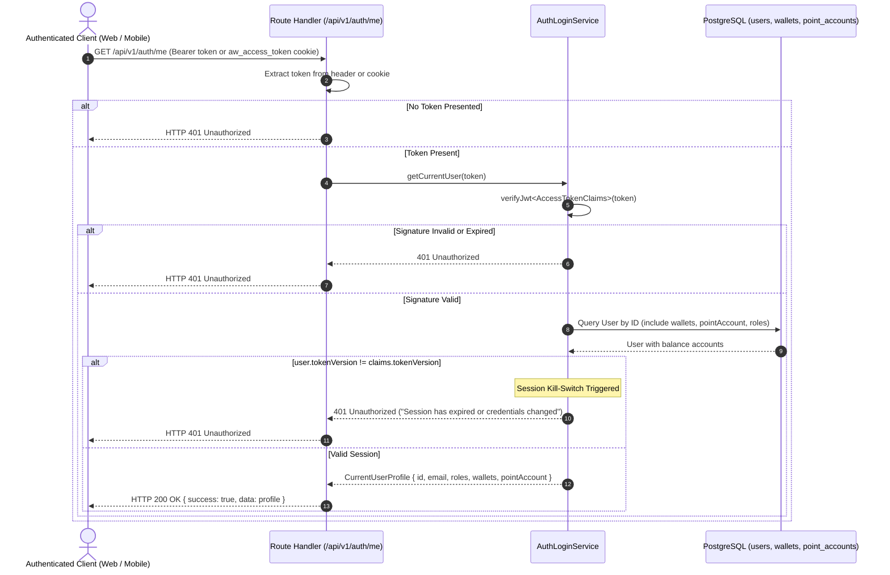
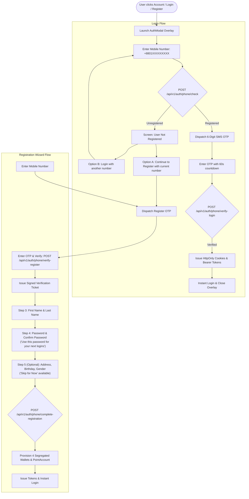

# Login and Access Token Issuance Architecture Specification

## 1. Executive Summary

Milestone 034 implements the central login, session establishment, and access-token issuance architecture for AlifWorld. This specification details the end-to-end mechanisms governing multi-identifier user resolution (email or Bangladesh mobile number), constant-time password hash verification, dual-client credential delivery (HttpOnly cookies for web browsers and Bearer tokens for mobile Flutter apps), multi-tenant seller scoping, concurrent session capping, and session introspection (`/api/v1/auth/me`).

The architecture satisfies **ADR-0034**, **ADR-0022**, **ADR-0031**, **ADR-0032**, and **ADR-0033**, ensuring enterprise security compliance, zero credential leakage, and seamless cross-platform identity management.

---

## 2. End-to-End Login & Token Issuance Flow



---

## 3. Current User Profile Flow (`GET /api/v1/auth/me`)



---

## 4. Multi-Tenant Seller Scoping Resolution

During authentication, `AuthLoginService` evaluates user relationships to dynamically resolve merchant tenant scoping:
1. **Seller Owner**: If `user.ownedSellers.length > 0`, extracts `ownedSellers[0].id`.
2. **Seller Staff**: If `user.sellerStaff.length > 0`, extracts `sellerStaff[0].sellerId`.
3. **Role Assignment Scoping**: If `user.roleAssignments` contains a `sellerId` override, binds that tenant ID.
4. **Token Claim Injection**: The resolved `sellerId` is injected into `AccessTokenClaims.sellerId` and serialized into the signed JWT. Subsequent API gateway middleware and repositories enforce tenant boundary isolation against this claim.

---

## 5. Concurrent Session Management Policy

To protect customer wallets, reward points, and merchant store configurations from account sharing and unauthorized access:
- **Maximum Concurrent Sessions**: Configured as `TOKEN_POLICIES.MAX_ACTIVE_SESSIONS_PER_USER = 5`.
- **Enforcement**: Upon successful login, `SessionRepository.enforceSessionLimit` queries all non-revoked sessions for that user sorted by `lastActiveAt DESC`.
- **Surplus Eviction**: If active sessions > 5, surplus oldest sessions are updated to `isRevoked = true`, `revokedReason = 'EXCEEDED_MAX_CONCURRENT_SESSIONS'`.

---

## 6. REST API Contracts

### 6.1 User Login Endpoint

- **Method & Path**: `POST /api/v1/auth/login`
- **Request Body**:
  ```json
  {
    "identifier": "tanvir@example.com",
    "password": "Dhaka@Commerce#2026!",
    "clientType": "WEB",
    "deviceInfo": "MacBook Pro (Chrome 128)"
  }
  ```
- **Responses**:
  - `HTTP 200 OK`:
    ```json
    {
      "success": true,
      "data": {
        "user": {
          "id": "usr_01j7x4b9e8m02k3f8d7c6b5a1",
          "email": "tanvir@example.com",
          "phone": "+8801700112233",
          "name": "Tanvir Ahmed",
          "status": "ACTIVE",
          "isEmailVerified": true,
          "isPhoneVerified": true,
          "roles": ["CUSTOMER"],
          "permissions": ["orders:create", "orders:read"],
          "sellerId": null,
          "lastLoginAt": "2026-09-22T12:00:00.000Z"
        },
        "tokens": {
          "accessToken": "eyJhbGciOiJIUzI1NiIsInR5cCI6IkpXVCJ9...",
          "refreshToken": "eyJhbGciOiJIUzI1NiIsInR5cCI6IkpXVCJ9...",
          "tokenType": "Bearer",
          "expiresIn": 900,
          "refreshExpiresIn": 604800
        },
        "sessionId": "ses_01j7x4b9e8m02k3f8d7c6b5a1"
      }
    }
    ```
  - `HTTP 401 Unauthorized`:
    ```json
    {
      "success": false,
      "error": {
        "code": "UNAUTHORIZED",
        "message": "Invalid email/phone or password"
      }
    }
    ```
  - `HTTP 422 Unprocessable Entity`:
    ```json
    {
      "success": false,
      "error": {
        "code": "VALIDATION_FAILED",
        "message": "Invalid login parameters"
      }
    }
    ```

### 6.2 Current User Profile Endpoint

- **Method & Path**: `GET /api/v1/auth/me`
- **Headers**: `Authorization: Bearer <token>` (or `aw_access_token` cookie)
- **Response**: `HTTP 200 OK`:
  ```json
  {
    "success": true,
    "data": {
      "id": "usr_01j7x4b9e8m02k3f8d7c6b5a1",
      "email": "tanvir@example.com",
      "phone": "+8801700112233",
      "name": "Tanvir Ahmed",
      "avatarUrl": null,
      "status": "ACTIVE",
      "isEmailVerified": true,
      "isPhoneVerified": true,
      "roles": ["CUSTOMER"],
      "permissions": ["orders:create", "orders:read"],
      "sellerId": null,
      "wallets": [
        {
          "id": "wal_01j7x4b9e8m02k3f8d7c6b5a1",
          "type": "MAIN",
          "currency": "BDT",
          "availablePoisha": "50000",
          "pendingPoisha": "0",
          "status": "ACTIVE"
        }
      ],
      "pointAccount": {
        "id": "pac_01j7x4b9e8m02k3f8d7c6b5a1",
        "availablePoints": 450,
        "pendingPoints": 0,
        "lifetimePoints": 450
      },
      "lastLoginAt": "2026-09-22T12:00:00.000Z"
    }
  }
  ```

---

## 7. Phone-First OTP Authentication & Luxury Storefront Overlay Architecture

To match the high-end Golden Amber (`#F59E0B`) and Brand Orange (`#FF6A00`) aesthetic of the AlifWorld customer storefront, authentication is implemented via a reactive **Overlay Modal** (`AuthModal`) rather than requiring full-page navigation.



### 7.1 Key Endpoints
1. `POST /api/v1/auth/phone/check`: Queries user existence by normalized Bangladesh mobile number.
2. `POST /api/v1/auth/phone/send-otp`: Dispatches 6-digit OTP with 60s cooldown and 3/hr rate limits.
3. `POST /api/v1/auth/phone/verify-login`: Verifies login OTP, creates user session, sets cookies, and returns tokens.
4. `POST /api/v1/auth/phone/verify-register`: Verifies phone ownership during registration and produces a tamper-proof HMAC verification ticket.
5. `POST /api/v1/auth/phone/complete-registration`: Atomically creates user, provisions 4 segregated wallets (`MAIN`, `SHOPPING`, `GOOD_LUCK`, `CHARITY`), assigns `CUSTOMER` role, establishes session, and returns tokens.

### 7.2 Overlay UX Highlights
- **Backdrop Blur & Smooth Step Animation**: Delicately slides between verification steps without jarring reloads.
- **Bilingual Switcher**: Instant one-click toggle between Bengali (`বাংলা`) and English.
- **Smart Phone Input**: Supports both raw `01XXXXXXXXX` and E.164 `+8801XXXXXXXXX` prefixes.
- **Password Transparency**: Explicit guidance text informs the user to remember their password for subsequent logins.
- **Frictionless Optional Demographics**: Address, division, birthday, and gender can be specified or skipped with a single click.

