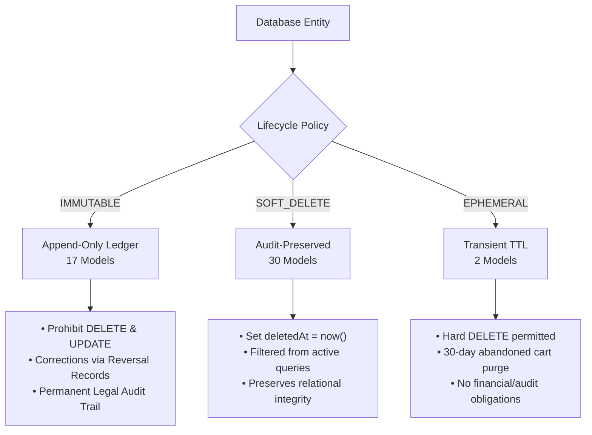

# Migration, Seed, and Database-Dictionary Workflows Architecture Specification

## 1. Executive Summary

Milestone 030 completes **Phase 03: Data Architecture** for the AlifWorld platform. Over the course of Milestones 021 through 030, the relational data model expanded into **49 canonical Prisma models** structured across 8 operational domains. 

This specification establishes the authoritative engineering contracts, operational procedures, and automation tooling governing:
1. **The 49-Model Catalog & Lifecycle Classification** (`IMMUTABLE`, `SOFT_DELETE`, `EPHEMERAL`).
2. **Expand-and-Contract Zero-Downtime Migration Protocols** for production PostgreSQL clusters.
3. **Forward-Fix Rollback Playbooks** ensuring zero data destruction or transaction loss.
4. **Idempotent Seed Automation** supporting multi-environment bootstrapping and initial SuperAdmin credential provisioning (`contact@mail.com`).
5. **Data Dictionary Synchronization** between Prisma schema AST, documentation (`docs/database/data-dictionary.md`), and the SuperAdmin Console (`/admin/database`).

---

## 2. The 49-Model Canonical Schema Domain Architecture

The AlifWorld persistence tier consists of exactly 49 relational Prisma models segregated across 8 modular domains:

| Domain Module | Models Count | Canonical Prisma Models | Primary ID Prefix | Primary Lifecycle |
|---|:---:|---|---|---|
| **System & Health** | 4 | `SystemConfig`, `HealthProbe`, `OutboxEvent`, `AuditLog` | `cfg_`, `prb_`, `obx_`, `aud_` | Mixed |
| **IAM & Multi-Tenancy** | 5 | `User`, `Role`, `Permission`, `UserRoleAssignment`, `RolePermission` | `usr_`, `rol_`, `prm_`, `ura_`, `rpm_` | `SOFT_DELETE` |
| **Seller & Storefront** | 4 | `Seller`, `SellerStaff`, `SellerKycDocument`, `SellerStoreSettings` | `sel_`, `stf_`, `kyc_`, `set_` | `SOFT_DELETE` |
| **Product Catalog & Media** | 6 | `Category`, `Brand`, `Product`, `ProductVariant`, `ProductMedia`, `ProductSlugHistory` | `cat_`, `brd_`, `prd_`, `var_`, `med_`, `slg_` | Mixed |
| **Multi-Warehouse Inventory**| 4 | `Warehouse`, `StockBalance`, `StockReservation`, `StockMovementLedger` | `wrh_`, `stk_`, `res_`, `mvt_` | Mixed |
| **Carts, Orders & Logistics** | 8 | `Cart`, `CartItem`, `Order`, `SellerFulfillmentGroup`, `OrderItem`, `OrderStatusHistory`, `Shipment`, `ShipmentEvent` | `crt_`, `cit_`, `ord_`, `sfg_`, `ori_`, `osh_`, `shp_`, `she_` | Mixed |
| **Payments & Settlements** | 7 | `Payment`, `Refund`, `RefundItem`, `CommissionLedger`, `SellerSettlement`, `SellerPayout`, `PaymentWebhookLog` | `pay_`, `ref_`, `rfi_`, `com_`, `stl_`, `pyo_`, `pwl_` | Mixed |
| **Wallets, Points & Ledgers** | 11 | `Wallet`, `LedgerAccount`, `LedgerJournal`, `LedgerPosting`, `PointAccount`, `PointEvent`, `RewardRule`, `RewardAllocation`, `RankDefinition`, `UserRank`, `LeaderboardSnapshot` | `wal_`, `lac_`, `jrn_`, `pos_`, `pac_`, `pev_`, `rwr_`, `rwa_`, `rnk_`, `urk_`, `lbs_` | Mixed |
| **Total** | **49** | | | |

---

## 3. Three-Tier Data Lifecycle Policies

To prevent accidental data loss and enforce compliance with Bangladesh national tax laws (NBR Mushak 6.3) and financial audit guidelines, every entity conforms to one of three lifecycle policies defined in `src/shared/database/lifecycle.ts`:



### Policy Details

1. **`IMMUTABLE` (Append-Only, 17 Models)**:
   - Includes: `HealthProbe`, `OutboxEvent`, `AuditLog`, `ProductSlugHistory`, `StockMovementLedger`, `OrderStatusHistory`, `ShipmentEvent`, `Payment`, `Refund`, `RefundItem`, `CommissionLedger`, `PaymentWebhookLog`, `LedgerJournal`, `LedgerPosting`, `PointEvent`, `RewardAllocation`, `LeaderboardSnapshot`.
   - **Invariants**: Once committed, rows are never modified or deleted. Errors in accounting are corrected by publishing linked reversal journals (`reversalOfId`).

2. **`SOFT_DELETE` (Preserved History, 30 Models)**:
   - Includes: `SystemConfig`, `User`, `Role`, `Permission`, `UserRoleAssignment`, `RolePermission`, `Seller`, `SellerStaff`, `SellerKycDocument`, `SellerStoreSettings`, `Category`, `Brand`, `Product`, `ProductVariant`, `ProductMedia`, `Warehouse`, `StockBalance`, `StockReservation`, `Order`, `SellerFulfillmentGroup`, `OrderItem`, `Shipment`, `SellerSettlement`, `SellerPayout`, `Wallet`, `LedgerAccount`, `PointAccount`, `RewardRule`, `RankDefinition`, `UserRank`.
   - **Invariants**: Deletion sets `deletedAt = new Date()`. Soft-deleted entities retain relationships to historical orders and ledger entries.

3. **`EPHEMERAL` (Transient TTL, 2 Models)**:
   - Includes: `Cart`, `CartItem`.
   - **Invariants**: Operational artifacts that may be safely hard-deleted by background maintenance jobs after 30 days of abandonment.

---

## 4. Expand-and-Contract Zero-Downtime Migration Architecture

AlifWorld mandates the **Expand-and-Contract** pattern for all schema modifications to guarantee zero downtime and eliminate connection starvation during deployments.

```mermaid
sequenceDiagram
    autonumber
    actor Dev as Platform Engineer
    participant DB as PostgreSQL Cluster
    participant OldApp as Running App (v1.0)
    participant NewApp as Deploying App (v1.1)

    Note over DB,OldApp: Normal Operation: App v1.0 reads/writes legacy column
    Dev->>DB: Phase 1 (Expand Migration): Add new column (nullable/defaulted)
    Dev->>NewApp: Deploy App v1.1
    Note over NewApp: App v1.1 dual-writes to both legacy and new column
    OldApp->>DB: Reads legacy column
    NewApp->>DB: Reads new column, dual-writes
    Dev->>DB: Phase 2 (Backfill): Asynchronous batch backfill of legacy data
    Note over OldApp: Old App v1.0 terminated; all traffic on v1.1
    Dev->>DB: Phase 3 (Contract Migration in v1.2): Drop legacy column safely
```

### Zero-Downtime Rules
1. **Never rename columns in-place**: Create the new column, dual-write, backfill, migrate reads, and drop the legacy column in a subsequent release.
2. **Never add non-null columns without defaults**: All new columns must either be nullable or have a database-level default.
3. **Non-blocking index creation**: Large table indexes must use `CREATE INDEX CONCURRENTLY` to avoid exclusive write table locks.
4. **Partition high-volume audit tables**: `AuditLog`, `LedgerPosting`, and `OutboxEvent` are architected for monthly range partitioning.

---

## 5. Forward-Fix Rollback Playbook

Destructive operations such as `prisma migrate reset` are strictly prohibited in staging and production environments.

### Incident Recovery Matrix

| Incident Type | Immediate Mitigation | Resolution Action |
|---|---|---|
| **Application Crash Loop after Deployment** | Roll back Kubernetes Deployment to previous Docker image | The database remains backward-compatible due to Expand phase. Fix application code in new release. |
| **Faulty Migration (Syntax/Constraint Issue)** | Cancel migration pipeline immediately | Author a forward-fix migration (`YYYYMMDDHHMMSS_forward_fix_...`) that reverts or fixes the constraint. |
| **Corrupted Data Backfill** | Pause the backfill worker job | Run compensating data correction script within an audited `AuditLog` transaction. |
| **Lock Contention / Slow Migration Query** | Terminate blocking backend PID via `pg_terminate_backend()` | Re-run query with non-blocking parameters or during scheduled low-traffic window. |

---

## 6. Seed Idempotency & SuperAdmin Provisioning

The seed script (`prisma/seed.ts`) is designed to run repeatedly without side-effects or errors.

### Upsert-Only Architecture Across 10 Sections
1. **System Configuration**: Upserts global platform keys (`APP_NAME`, `PLATFORM_COMMISSION_BPS`, `DEFAULT_CURRENCY`).
2. **Health Probes**: Records bootstrap readiness probes.
3. **Core Permissions**: 38 standardized permissions (`users:read`, `catalog:write`, etc.).
4. **System Roles & Initial SuperAdmin**:
   - Creates `SUPERADMIN`, `ADMIN`, `SELLER`, `CUSTOMER`, `SUPPORT`, `AUDITOR`.
   - Provisions `contact@mail.com` with `INITIAL_SUPERADMIN_PASSWORD` (or fallback).
   - Flags SuperAdmin with mandatory password change requirement on initial login.
5. **Demonstration Seller & Store**: Seeds verified seller with Trade License and TIN.
6. **Catalog Structure**: Root categories and authorized brands.
7. **Multi-Warehouse Logistics**: Central Dhaka fulfillment warehouse.
8. **Sample Products & Variants**: Baseline catalog with exact poisha pricing and independent Product Points.
9. **Logistics & Orders**: Initial fulfillment groups and shipping events.
10. **Financial Ledgers, Wallets & Points**: Full chart of accounts (`ASSET`, `LIABILITY`, `EQUITY`, `REVENUE`, `EXPENSE`), segregated wallets (`MAIN`, `SHOPPING`, `GOOD_LUCK`, `CHARITY`), and initial balanced double-entry journal.

---

## 7. Automated Data Dictionary Tooling

1. **Generation CLI**: `bun run scripts/generate-data-dictionary.ts`
   - Parses AST of `prisma/schema.prisma`.
   - Reads model metadata, field types, nullability, unique attributes, and relationships.
   - Merges lifecycle rules from `src/shared/database/lifecycle.ts`.
   - Outputs markdown document to `docs/database/data-dictionary.md`.
2. **SuperAdmin Web Console**: `src/app/admin/database/page.tsx`
   - Accessible to platform engineers at `/admin/database`.
   - Interactive table search, lifecycle policy filters (`IMMUTABLE`, `SOFT_DELETE`, `EPHEMERAL`), migration tracking, and expand-and-contract runbooks.
