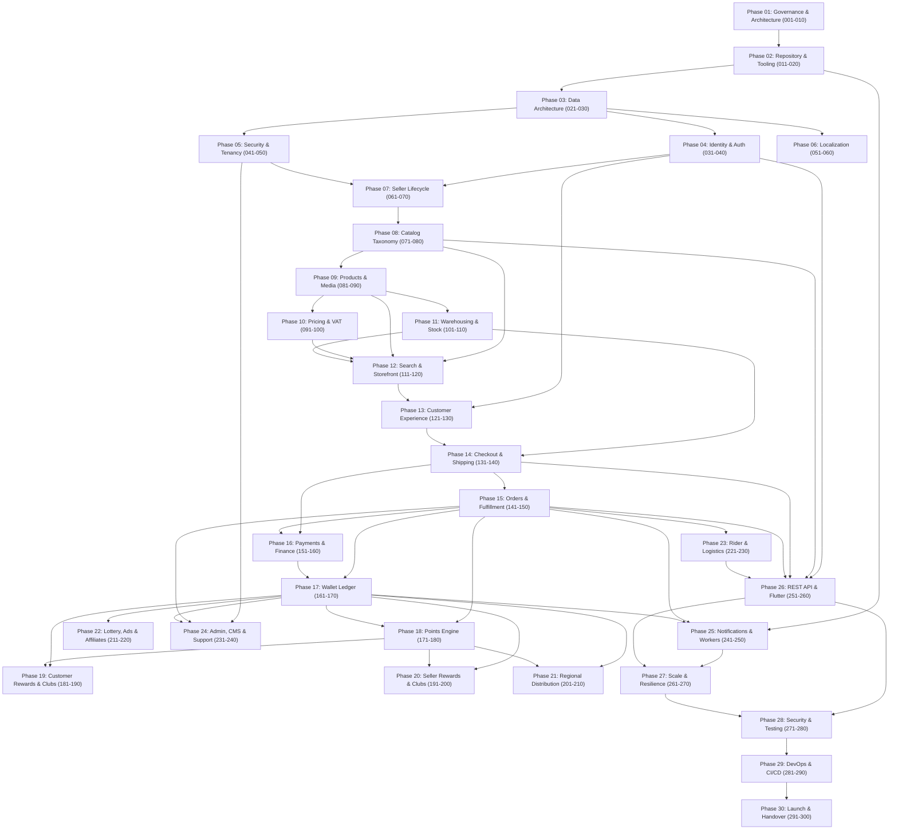

# AlifWorld Milestone Dependency Graph & Incremental Delivery Workflow

**Document Type**: Architectural Execution Framework & Dependency Governance  
**Phase Reference**: Phase 01 — Governance and Architecture  
**Milestone Reference**: [Milestone 007](../../AlifWorld-300-Milestones/007-milestone-dependency-graph-and-incremental-delivery-workflow.md)  
**Total Milestones**: 300 across 30 Phases  
**Status**: Authoritative & Mandatory  

---

## 1. Topological Delivery Architecture & Phase Gates

The 300 milestones of AlifWorld execute according to a **Directed Acyclic Graph (DAG)**. Milestones are structured so that each deliverable builds strictly upon verified, production-ready predecessor code without speculative forward branching or untested dependencies.



---

## 2. Phase-to-Phase Transition Gates

Progression across phase boundaries requires satisfying mandatory transition gates:

| Transition Boundary | Primary Gate Criteria | Blocking Risk if Violated |
|:---|:---|:---|
| **Phase 01 -> Phase 02** | Charter, reconciliation, domain boundaries, NFRs, glossary, and DAG fully documented and accepted. | Premature coding without agreed domain invariants or monetary rules. |
| **Phase 02 -> Phase 03** | Next.js initialized, Bun tooling configured, CI pipeline green, design tokens in place. | Broken lint/typecheck pipelines and unstandardized development environment. |
| **Phase 03 -> Phase 04** | Normalized Prisma models created, migrations reversible, poisha/points typed. | Schema churn causing breaking changes across auth, catalog, and checkout. |
| **Phase 05 -> Phase 07** | Server-side authorization and seller tenant isolation (`seller_id`) enforced. | Multi-tenant data leakage between independent sellers. |
| **Phase 11 -> Phase 14** | Atomic stock reservation and multi-warehouse ledger verified under concurrency. | Overselling inventory during multi-vendor customer checkout. |
| **Phase 16 -> Phase 17** | Payment gateway idempotency and signed webhook handling verified. | Ghost orders and lost funds due to untracked gateway transactions. |
| **Phase 18 -> Phase 19** | Mandatory seller-defined points, order snapshotting, and return reversals verified. | Inflated point calculations and reward fraud on cancelled orders. |
| **Phase 26 -> Phase 28** | OpenAPI specifications generated directly from Zod schemas; 100% Flutter parity. | Broken mobile client integration and divergent documentation. |
| **Phase 29 -> Phase 30** | Full regression, load testing (k6), and disaster recovery rehearsals completed. | Production outage or financial ledger imbalance during launch. |

---

## 3. The Incremental Milestone Execution Protocol

Every milestone (from 001 to 300) follows an immutable execution protocol:

```
[ 1. Verify Predecessor ] -> Must verify Milestone N-1 is status: completed
            │
            ▼
[ 2. Inspect Repository ] -> Locate touched files, routes, schemas, tests
            │
            ▼
[ 3. Contract First ]     -> Define Zod schemas, state machines, invariants
            │
            ▼
[ 4. Make Smallest Production Change ] -> Write real code; zero placeholders
            │
            ▼
[ 5. Execute Tests & Quality Checks ] -> bun run lint && typecheck && test
            │
            ▼
[ 6. Update Docs & Milestone File ]   -> Mark status completed and [x] criteria
            │
            ▼
[ 7. Emit 7-Part Completion Report ]  -> Detailed evidence-based handoff
```

### Dependency Rules for Executing Agents:
1. **Never Skip Milestones**: An agent cannot begin Milestone N if Milestone N-1 does not have its acceptance criteria checked `[x]` and its completion report published.
2. **Zero Forward Drift**: If a milestone encounters an unresolvable technical or business block, the agent must stop and record the issue in the decision log. Speculatively implementing parts of later milestones is forbidden.
3. **Atomic Commit per Milestone**: Each milestone forms an independent, buildable, tested Git commit.

---

## 4. Critical Path Analysis

The critical path represents the minimum sequence of dependent phases that must execute to achieve an end-to-end commerce transaction:

```
Critical Path (Days 1 to 30):
Phase 01 (Governance) ──> Phase 02 (Tooling) ──> Phase 03 (Data Models)
                     ──> Phase 04/05 (IAM & Security) ──> Phase 07 (Seller Onboarding)
                     ──> Phase 08/09 (Catalog & Products) ──> Phase 10/11 (Pricing & Stock)
                     ──> Phase 14/15 (Checkout & Orders) ──> Phase 16/17 (Payments & Ledger)
                     ──> Phase 18/19 (Points & Rewards) ──> Phase 26 (Flutter API)
                     ──> Phase 28/29 (QA & DevOps) ──> Phase 30 (Launch)
```

Parallel streams (e.g. Phase 06 Localization, Phase 23 Rider Logistics, Phase 24 CMS) branch from verified data models and converge prior to Phase 26 (REST API integration).
