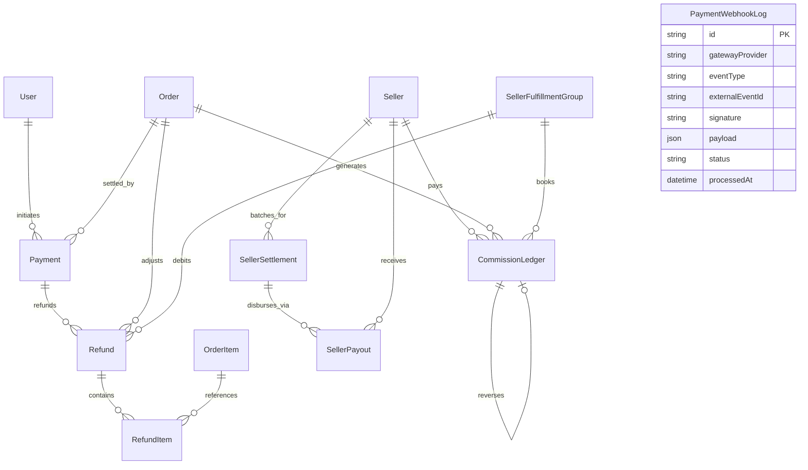
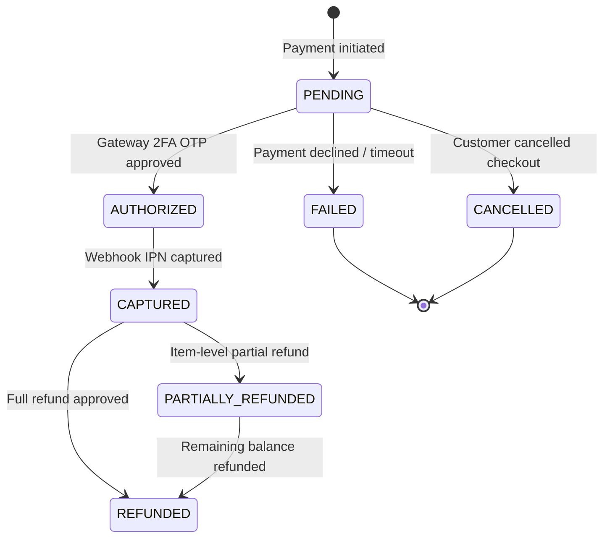
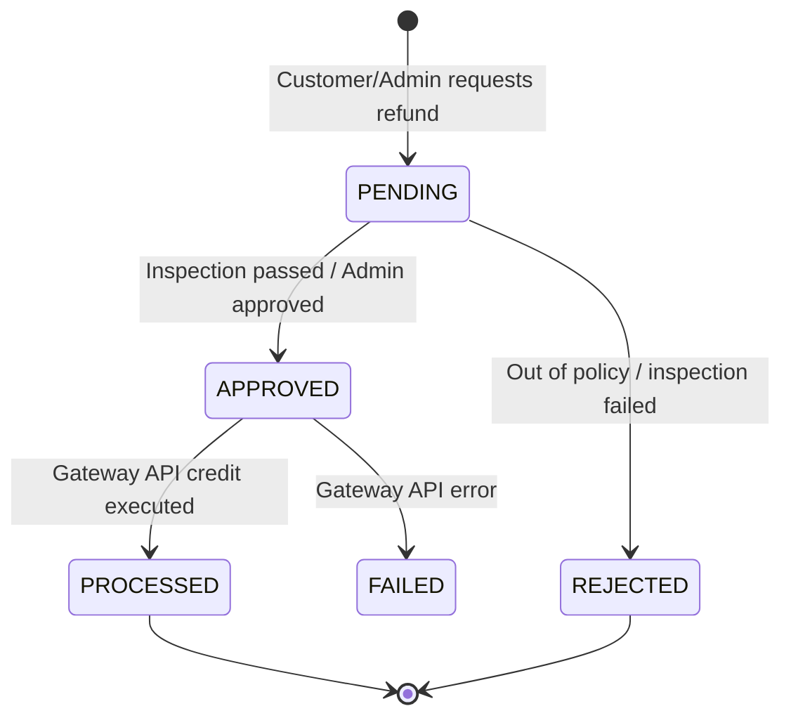
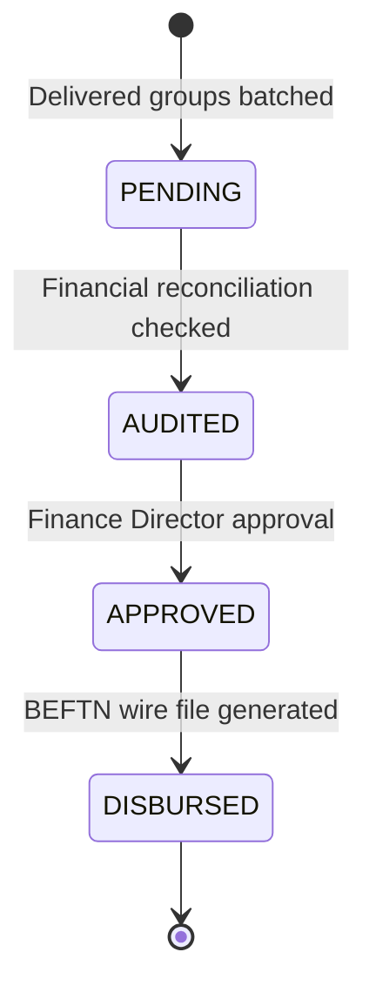

# Payments, Refunds, Commissions, Settlements, and Payouts Architecture Specification

## 1. Executive Summary

Milestone 028 establishes AlifWorld's end-to-end financial transaction pipeline, gateway reconciliation engine, item-level partial refund system, platform commission ledger, periodic merchant clearing batches, and electronic bank wire payout disbursals in Bangladesh.

The architecture satisfies **ADR-0028**, **ADR-0003**, **ADR-0022**, and **ADR-0025**, providing mathematical guarantees of exact minor-unit bookkeeping, multi-tenant merchant isolation, cryptographic webhook verification, and append-only auditability.

---

## 2. Core Invariants & Mathematical Guarantees

### Invariant 1: Exact Integer Minor Unit Accounting (Poisha)
All monetary attributes (`amountPoisha`, `feePoisha`, `taxPoisha`, `commissionPoisha`, `sellerDeductionPoisha`, `grossOrderPoisha`, `netPayoutPoisha`) are represented exclusively as 64-bit integer minor units (`BigInt` poisha, where $1\text{ BDT} = 100\text{ poisha}$).
Floating-point numbers (`number`, `DECIMAL`, `FLOAT`) are strictly prohibited in database columns and application domain calculation.

$$\text{Taka} = \frac{\text{Poisha}}{100}$$

### Invariant 2: Bounded Partial Refund Ceiling
A customer may receive one or multiple partial refunds on an order (e.g. for damaged items or out-of-stock SKUs). At all times, the cumulative sum of processed and approved refunds for an order must not exceed the captured payment amount:

$$\sum_{i=1}^{k} \text{Refund}_{i}.\text{amountPoisha} \le \text{Payment}.\text{amountPoisha}$$

Any refund request violating this invariant is rejected at the domain validation boundary (`PaymentReconciliationService`).

### Invariant 3: Independent Product Points (PP) Loyalty Reversals
Product Points are decoupled loyalty tokens and do not have an automated or speculative exchange rate with BDT currency. When an item is refunded:
- The exact snapshotted Product Points assigned to the refunded line item units are reversed.
- The user's pending or earned Product Points balance is decremented by the exact item token amount.
- The BDT refund amount returned to the customer is independent of the point reversal.

$$\Delta \text{Points} = - (\text{RefundItem}.\text{quantity} \times \text{OrderItem}.\text{productPointSnapshot})$$

### Invariant 4: Platform Commission Rule Versioning & Signed Reversals
The platform charges merchants a fee for marketplace services (default $5.00\% = 500\text{ bps}$) computed on the gross item subtotal:

$$\text{CommissionPoisha} = \left\lfloor \frac{\text{BasisAmountPoisha} \times \text{CommissionRateBps}}{10000} \right\rfloor$$

- Every commission entry records the locked immutable rule version (`v1.0.0`).
- If an item or order is subsequently refunded, a signed reversal entry with a negative commission amount is inserted into the `CommissionLedger`, referencing the original entry via `reversalOfId`.

### Invariant 5: Net Seller Settlement Conservation
Delivered fulfillment groups are batched into periodic merchant settlements. The net payout is strictly conserved:

$$\text{NetPayoutPoisha} = \text{GrossOrderPoisha} + \text{ShippingFeePoisha} + \text{TaxPoisha} - \text{CommissionPoisha} - \text{RefundDeductions}$$

### Invariant 6: Gateway Webhook Verification & Replay Protection
All incoming webhooks from Bangladeshi payment providers (bKash, Nagad, SSLCommerz) are cryptographically validated against provider HMAC SHA-256 signatures. Payloads are deduplicated using `gatewayProvider` and `externalEventId`. Duplicate events trigger an idempotent `200 OK` without re-executing state transitions.

---

## 3. Entity-Relationship Diagram

---

## 4. State Machines

### 4.1 Payment Lifecycle

### 4.2 Refund Lifecycle

### 4.3 Settlement & Payout Lifecycle

---

## 5. Security & Multi-Tenant Scoping

1. **Merchant Financial Isolation**:
   - Every read and aggregation query in `SettlementRepository` requires `sellerId` as a non-optional parameter.
   - Merchants can only view settlement batches, payouts, and commissions linked to their own store.
2. **Cryptographic Webhook Signatures**:
   - Gateway webhooks check `X-Signature` using `crypto.createHmac('sha256', secret)`.
   - Timing-safe comparisons (`crypto.timingSafeEqual`) prevent timing side-channel attacks.
3. **Immutability Classification**:
   - `Payment`, `Refund`, `RefundItem`, `CommissionLedger`, `SellerPayout`, and `PaymentWebhookLog` are declared `IMMUTABLE` in `src/shared/database/lifecycle.ts`.
   - Modifying or hard-deleting historical records raises a runtime `ValidationError`.
