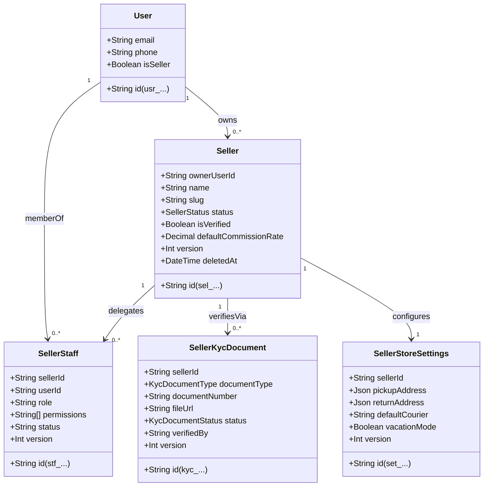

# Seller, Staff, KYC Documents, and Store Settings Architecture

**Document Type**: Architectural Specification & Domain Data Model  
**Phase Reference**: Phase 03 — Data Architecture  
**Milestone Reference**: [Milestone 024](../../AlifWorld-300-Milestones/024-model-sellers-seller-staff-kyc-documents-and-store-settings.md)  
**Supporting ADR**: [ADR-0024](../decisions/0024-model-sellers-seller-staff-kyc-documents-and-store-settings.md)  
**Status**: Authoritative & Accepted  

---

## 1. Domain Overview & Multi-Tenant Hierarchy

In AlifWorld, the merchant marketplace operates as a **logical multi-tenant architecture** within the single-application modular monolith. Each merchant storefront constitutes an isolated tenant bounded by a unique identifier (`sellerId` / `sel_...`).



---

## 2. Relational Schema & Persistence Constraints

### 2.1 Seller Model (`sellers`)
- **Primary Identifier**: `id` with prefix `sel_` (e.g., `sel_dhaka_tech_01`).
- **Owner Foreign Key**: `ownerUserId` referencing `users(id)` with `ON DELETE RESTRICT`.
- **Slug Constraint**: `slug` is unique across the entire platform.
- **Tax Credentials**:
  - `tradeLicenseNumber`: Optional string registered with municipal city corporation or pourashava.
  - `binNumber`: Optional 13-digit Business Identification Number issued by NBR.
  - `tinNumber`: Optional 12-digit Taxpayer Identification Number issued by NBR.
- **Financial Controls**:
  - `defaultCommissionRate`: Decimal representing platform take-rate (default 5.00%).
- **Concurrency**: `version` integer incremented on every update (OCC).
- **Soft Deletion**: `deletedAt` timestamp; filtered out from standard queries.

### 2.2 SellerStaff Model (`seller_staff`)
- **Primary Identifier**: `id` with prefix `stf_`.
- **Compound Uniqueness**: `@@unique([sellerId, userId])` ensures a user can hold only one staff membership record per store.
- **Permissions**: String array storing granular action scopes (e.g., `ORDERS_READ`, `PRODUCTS_UPDATE`).
- **Status**: `ACTIVE`, `INVITED`, `SUSPENDED`.

### 2.3 SellerKycDocument Model (`seller_kyc_documents`)
- **Primary Identifier**: `id` with prefix `kyc_`.
- **Tenant Scope**: `sellerId` referencing `sellers(id)` with cascade deletion when tenant is purged.
- **Document Classification**:
  - `TRADE_LICENSE`: Mandatory City Corporation / Union Parishad trade license.
  - `BIN_CERTIFICATE`: Mandatory NBR 13-digit VAT registration.
  - `TIN_CERTIFICATE`: Mandatory 12-digit income tax certificate.
  - `NID_FRONT` & `NID_BACK`: Bangladesh National Identity card of the store owner.
  - `BANK_CHEQUE_LEAF`: Cancelled cheque leaf verifying settlement bank account title.
  - `UTILITY_BILL`: Proof of commercial warehouse address.
- **Security Invariant**: `fileUrl` stores private S3 object keys. Public web access is prohibited; clients receive 15-minute temporary presigned download URLs.

### 2.4 SellerStoreSettings Model (`seller_store_settings`)
- **Primary Identifier**: `id` with prefix `set_`.
- **One-to-One Relation**: `sellerId` unique constraint ensures exactly one settings record per merchant.
- **Logistics Defaults**:
  - `defaultCourier`: Enum / string (`STEADFAST`, `PATHAO`, `ECOURIER`, `REDX`, `PAPERFLY`).
  - `autoAcceptOrders`: Boolean toggling automated order pipeline ingestion.
  - `vacationMode`: Boolean preventing buyers from checking out items while merchant operations are paused.
  - `warehouseAddress`: JSON schema storing Division, District, Thana, Street Address, and Postal Code.

---

## 3. Lifecycle State Machines

### 3.1 Seller Account Lifecycle
```
[DRAFT]
   │
   ▼ (Submit mandatory KYC docs)
[PENDING_VERIFICATION]
   │
   ├───────────────────────────────┐
   ▼ (Admin reviews & approves)    ▼ (Admin rejects docs)
[ACTIVE]                        [REJECTED]
   │                               │
   ├────────────────┐              ▼ (Re-upload corrected docs)
   ▼ (Violation)    ▼ (Voluntary) [PENDING_VERIFICATION]
[SUSPENDED]      [INACTIVE]
```

### 3.2 KYC Document Lifecycle
```
[PENDING] ──► [UNDER_REVIEW] ──┬──► [VERIFIED] (Approved by Compliance Admin)
                               └──► [REJECTED] (Requires re-submission with reason)
```

---

## 4. Access Control Matrix & Security Boundaries

| Operation | Anonymous / Buyer | Seller Staff | Seller Owner | Super Admin |
| :--- | :---: | :---: | :---: | :---: |
| **Browse Public Store Profile** | Yes | Yes | Yes | Yes |
| **Register New Storefront** | No | No | Yes (Customer becomes Owner) | Yes |
| **Update Store Logistics Settings** | No | With `SETTINGS_UPDATE` | Yes (Own Store Only) | Yes |
| **Invite / Revoke Store Staff** | No | No | Yes (Own Store Only) | Yes |
| **Upload KYC Regulatory Documents** | No | No | Yes (Own Store Only) | Yes |
| **Inspect KYC Document (Presigned URL)** | No | No | Yes (Own Store Only) | Yes (Audited) |
| **Verify / Reject KYC Document** | No | No | No | Yes (Admin Console) |
| **Modify Platform Commission Rate** | No | No | No | Yes (Maker-Checker) |
| **Suspend / Reactivate Store** | No | No | No | Yes (Admin Console) |

---

## 5. Event Publishing & Audit Trail

All critical merchant lifecycle operations emit outbox events and record entries in the audit trail:

1. `SELLER_REGISTERED`: Published upon store creation with status `DRAFT`.
2. `SELLER_KYC_SUBMITTED`: Published when a merchant submits regulatory documents for review.
3. `SELLER_KYC_VERIFIED`: Emitted when compliance officer approves a submitted document.
4. `SELLER_STATUS_CHANGED`: Emitted on transitions to `ACTIVE` or `SUSPENDED`.
5. `SELLER_KYC_VIEW`: Emitted whenever any user requests a signed presigned URL to view sensitive identity or tax certificates.
