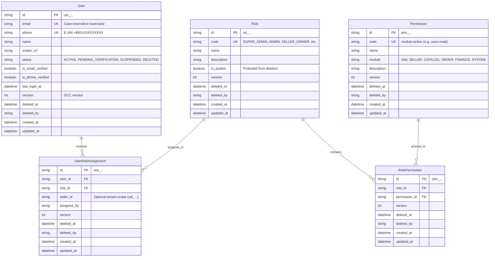

# User, Role, Permission, and Role Assignment Data Architecture

**Document Type**: Architectural Specification & Persistence Standard  
**Phase Reference**: Phase 03 — Data Architecture  
**Milestone Reference**: [Milestone 023](../../AlifWorld-300-Milestones/023-model-users-roles-permissions-and-role-assignments.md)  
**Status**: Authoritative / Implemented  
**Date**: 2026-09-22  
**Related Decision**: [ADR-0023](../decisions/0023-model-users-roles-permissions-and-role-assignments.md)  

---

## 1. Executive Summary & Scope

Milestone 023 models the persistent data structures and domain logic for **Identity & Access Management (IAM)** within the AlifWorld modular monolith.

The core objectives delivered by this architecture are:
1. **Normalized PostgreSQL Schema**: Normalized models in `prisma/schema.prisma` for `User` (`users`), `Role` (`roles`), `Permission` (`permissions`), `RolePermission` (`role_permissions`), and `UserRoleAssignment` (`user_role_assignments`).
2. **Standardized Prefixed Identifiers**: Integration with ADR-0022 k-sortable identifiers (`usr_...`, `rol_...`, `prm_...`, `rpm_...`, `ura_...`).
3. **Optimistic Concurrency & Soft-Deletion**: OCC integer versioning (`version`) and soft-delete classification (`deletedAt`, `deletedBy`) with protected system role guards.
4. **Bangladesh Phone Normalization**: Strict E.164 normalization (`+8801[3-9]XXXXXXXX`) ensuring unique mobile identities across customer and operational surfaces.
5. **Multi-Tenant Seller Role Scoping**: Role assignments support optional `sellerId` tenant scoping, isolating seller staff and owners from unauthorized cross-tenant operations while allowing Super Admins platform-wide management.
6. **UI Integration**: Operational Admin console views for User Management (`src/app/admin/users/page.tsx`) and Roles & Permissions (`src/app/admin/roles/page.tsx`).

---

## 2. Entity-Relationship Model (ERD)

---

## 3. Standard Roles & Permission Matrices

The platform implements 9 pre-seeded standard system roles:

| Role Code | Role Name | Scope | Key Capabilities |
|:---|:---|:---:|:---|
| `SUPER_ADMIN` | Super Administrator | Global | Unrestricted access across all contexts; Maker-Checker final overrides. |
| `ADMIN` | Platform Administrator | Global | Manages seller approvals, catalog moderation, platform configurations, and audit review. |
| `OPERATIONS` | Operations & Logistics Manager | Global | Oversees fulfillment, delivery dispatch, return triage, and warehouse routing. |
| `SUPPORT` | Customer Support Agent | Global | Read-only inspection of orders, accounts, and redacted customer/seller data. |
| `FINANCE` | Financial Officer | Global | Ledger journal entries, Maker-Checker balance approvals, and seller payout authorization. |
| `SELLER_OWNER` | Store Merchant Owner | Tenant-Scoped | Manages store profile, products, order packing, staff delegation, and settlement ledgers. |
| `SELLER_STAFF` | Store Staff Member | Tenant-Scoped | Restricted store operations: product drafting and order pack/handover workflows. |
| `CUSTOMER` | Verified Shopper | Global | Catalog browsing, cart checkout, order tracking, address book, and loyalty point review. |
| `RIDER` | Delivery Rider | Global | Delivery task acceptance, GPS ping reporting, and OTP proof-of-delivery confirmation. |

---

## 4. Multi-Tenant Scoping & Security Rules

1. **Tenant Isolation Invariant**:
   - For `SELLER_OWNER` and `SELLER_STAFF` roles, `sellerId` is **mandatory** on `UserRoleAssignment`.
   - When resolving permissions for a seller operation, `RbacService.assertSellerTenantAccess(userId, sellerId)` checks that the user holds an active role with `sellerId == targetSellerId`.
   - Any query attempting to access or mutate seller resources outside the user's assigned `sellerId` immediately throws an `AuthorizationError` (HTTP 403 Forbidden).
2. **Super Admin Privilege**:
   - `SUPER_ADMIN` role assignments have `sellerId: null` (global scope) and automatically bypass single-tenant restrictions.
3. **Protected System Roles**:
   - System roles marked `isSystem: true` cannot be soft-deleted or renamed via repository mutations.

---

## 5. Bangladesh Phone Normalization

All mobile numbers in AlifWorld are normalized and validated via `src/shared/utils/phone.ts`:
- **National Input Formats**: Accepts `01712-345678`, `+880 1712 345 678`, `8801712345678`, `01712345678`.
- **E.164 Output**: Strips formatting and converts to canonical `+8801[3-9]XXXXXXXX` (14 characters total).
- **Unique Database Constraint**: PostgreSQL enforces `@unique` on normalized `phone`, preventing duplicate account registrations.

---

## 6. Repository & Service Layer Architecture

Adhering to the 4-tier modular monolith architecture (ADR-0006, ADR-0013):

1. **Repositories (`src/features/identity/repositories/`)**:
   - `UserRepository`: Scoped queries, case-insensitive email lookups, E.164 phone searches, soft-delete patches, OCC version checks, and paginated searches.
   - `RoleRepository`: Role lookups, system role protection, and `RolePermission` junction assignments.
   - `PermissionRepository`: Modular permission catalogue indexing and slug lookups.
   - `UserRoleAssignmentRepository`: Idempotent role assignments, revocations, and multi-tenant effective permission resolution.
2. **Services (`src/features/identity/services/`)**:
   - `UserService`: User onboarding, phone normalization, email/phone collision prevention, status transitions, and Transactional Outbox event publishing (`USER_REGISTERED`).
   - `RbacService`: Dynamic permission evaluation, tenant scoping assertions (`assertSellerTenantAccess`), and privilege-safe role delegation.

---

## 7. Operational Admin UI Integration

Located at `src/app/admin/users/page.tsx` and `src/app/admin/roles/page.tsx`:
- Conforms 100% to the AlifWorld design system (`tokens.css`, `Card`, `Badge`, `Button`, `Table`, `Input`).
- Pure Black (`#000000`) foundation with Brand Orange (`#FF6A00`) accents.
- WCAG 2.1 AAA accessible contrast on all tabular and card presentations.
- Provides search by name/email/phone, status filtering, and role chips.
