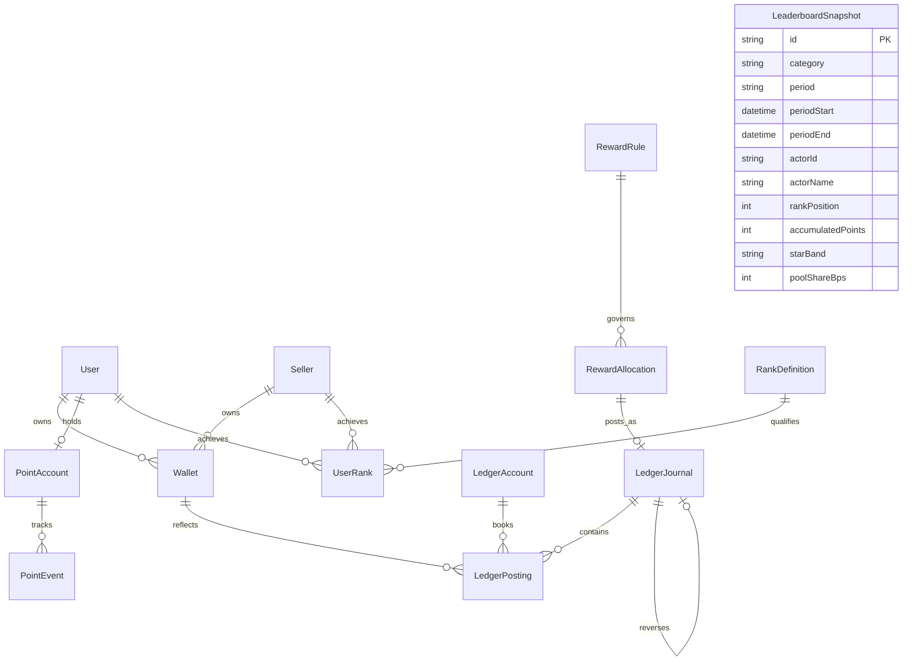

# Wallets, Points, Rewards, Ranks & Immutable Ledgers Architecture Specification

## 1. Executive Summary

Milestone 029 establishes AlifWorld's formal double-entry financial ledger, multi-account wallet architecture, decoupled loyalty rewards engine, and competitive rank qualification framework.

The architecture satisfies **ADR-0029**, **ADR-0003**, **ADR-0022**, and **ADR-0028**, providing mathematical guarantees of exact minor-unit bookkeeping, zero-sum journal conservation, decoupled loyalty points, and append-only auditability.

---

## 2. Core Invariants & Mathematical Guarantees

### Invariant 1: Double-Entry Conservation
A wallet balance is never updated via an unbacked single-row modification. Every financial event creates an atomic `LedgerJournal` with multiple `LedgerPosting` entries satisfying:

$$\sum \text{Debits} = \sum \text{Credits} = \text{totalPoisha}$$

For liability accounts (customer wallets):
- A `CREDIT` posting increases the wallet's available balance: $\Delta \text{Balance} = + \text{amountPoisha}$.
- A `DEBIT` posting decreases the wallet's available balance: $\Delta \text{Balance} = - \text{amountPoisha}$.

Available balances are protected against negative balance conditions ($\text{availablePoisha} \ge 0$).

### Invariant 2: Decoupled Product Points (PP) System
Product Points are discrete integer tokens ($PP \in \mathbb{N}_0$) allocated per SKU. **The platform never infers a conversion rate between BDT currency and Product Points.**
- Snapshotted on order placement into `pendingPoints`.
- Released into `availablePoints` and `lifetimePoints` upon order completion and closure of the return window.
- On item refund, points are clawed back via signed negative `PointEvent` records without altering currency ratios.

### Invariant 3: 100% Split Sum Invariant & Residual Policy
Every versioned reward split rule must be validated to sum to exactly 10,000 basis points (100.00%) before activation:

$$\sum_{t \in \text{Targets}} \text{SplitBps}(t) = 10,000\text{ bps}$$

When distributing rewards on a basis amount, discrete integer poisha are allocated:

$$\text{Allocated}(t) = \left\lfloor \frac{\text{BasisPoisha} \times \text{SplitBps}(t)}{10,000} \right\rfloor$$

Any division residual:

$$\text{ResidualPoisha} = \text{BasisPoisha} - \sum_{t} \text{Allocated}(t)$$

is assigned directly to the primary `MAIN` wallet target, guaranteeing that the exact funded basis is distributed with zero leakage.

### Invariant 4: Star Bands & Rank Tier Definitions
- **Customer Club Points (Daily)**: Bronze (3,000 pts), Silver (4,000 pts), Gold (5,000 pts) with reference pool shares of 1%, 2%, 3%.
- **Seller Club Points (Daily)**: Bronze (10,000 pts), Silver (30,000 pts), Gold (100,000 pts) with reference pool shares of 1%, 2%, 3%.
- **Competitive Star Bands**: Mega Star (positions 1–10), Super Star (11–50), Star (51–100); each band references 1.0% of its approved period pool.

---

## 3. Entity-Relationship Diagram

---

## 4. Multi-Account Wallet Hierarchy

Each user and seller has distinct, segregated wallets:
1. **`MAIN` Wallet**: Withdrawable to commercial banks (City Bank BEFTN/RTGS) or MFS (bKash/Nagad). Fully spendable on storefront.
2. **`SHOPPING` Wallet**: Non-withdrawable commercial store credits reserved strictly for cart checkout.
3. **`GOOD_LUCK` Wallet**: Promotional lottery balances dedicated to weekly and monthly prize draws.
4. **`CHARITY` Wallet**: Allocated donation balances disbursed to verified charitable institutions in Bangladesh.

---

## 5. Chart of Accounts Registry

| Code | Title | Type | Description |
|---|---|---|---|
| `1010-CASH-GATEWAY` | Cash at Digital Gateway | `ASSET` | Inward funds collected via bKash, Nagad, and SSLCommerz |
| `2010-CUSTOMER-MAIN-LIABILITY` | Customer Main Wallet | `LIABILITY` | Withdrawable customer fiat balances held in trust |
| `2020-CUSTOMER-SHOPPING-LIABILITY` | Customer Shopping Wallet | `LIABILITY` | Customer store credit balances |
| `2030-CUSTOMER-GOODLUCK-LIABILITY` | Customer Good-Luck Wallet | `LIABILITY` | Promotional prize draw balance |
| `2040-CUSTOMER-CHARITY-LIABILITY` | Customer Charity Wallet | `LIABILITY` | Allocated charitable donations |
| `4010-PLATFORM-COMMISSION-REVENUE` | Platform Commission Revenue | `REVENUE` | Standard 5% platform cut on delivered goods |
| `4020-SERVICE-CHARGE-REVENUE` | Platform Service Charge Revenue | `REVENUE` | 10% reward service fee deduction |
| `5010-PROMOTIONAL-REWARDS-EXPENSE` | Promotional Rewards Expense Pool | `EXPENSE` | Corporate funded pool for customer incentives |

---

## 6. Security & Multi-Tenant Governance

1. **Strict Immutability**:
   - `LedgerJournal`, `LedgerPosting`, `PointEvent`, `RewardAllocation`, and `LeaderboardSnapshot` are marked `IMMUTABLE` in `src/shared/database/lifecycle.ts`.
   - Modifying or deleting records raises an immediate `ValidationError`. Adjustments require countervailing reversal journals.
2. **Tenant Scoping**:
   - Merchants can only query wallets, postings, and ranks tied to their verified `sellerId`.
