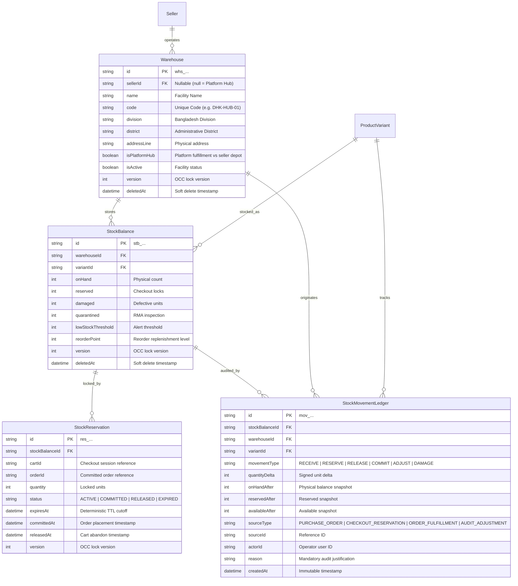
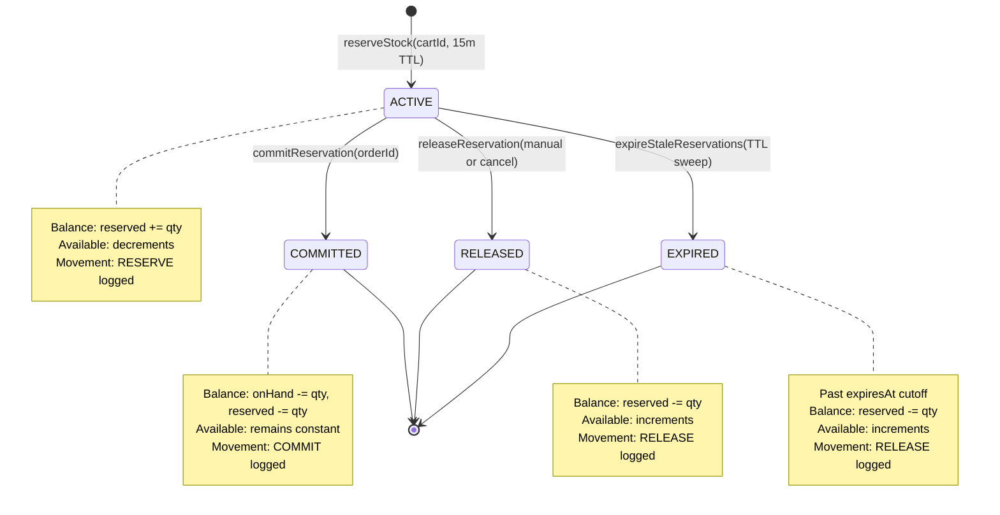

# Warehouse Logistics, Inventory Balances & Stock Movements Architecture Specification

## 1. Executive Summary

Milestone 026 establishes AlifWorld's foundational inventory domain model, providing multi-warehouse fulfillment across Bangladesh's 8 administrative divisions (Dhaka, Chittagong, Rajshahi, Khulna, Barisal, Sylhet, Rangpur, Mymensingh), optimistic concurrency control (OCC) for oversell prevention, atomic time-limited checkout reservations, and an immutable, append-only stock movement ledger.

This specification implements **ADR-0026**, **ADR-0003**, **ADR-0021**, and **ADR-0022**.

---

## 2. Core Invariants & Mathematical Guarantees

### Invariant 1: Authoritative Available Stock
Available stock is **strictly computed server-side** by the domain engine and never accepted as a client-supplied payload:

$$\text{Available} = \max(0, \text{OnHand} - \text{Reserved} - \text{Damaged} - \text{Quarantined})$$

- $\text{OnHand}$: Total physical units verified within the physical warehouse facility.
- $\text{Reserved}$: Units locked in active buyer checkout sessions prior to TTL expiration.
- $\text{Damaged}$: Physically defective or broken units removed from sales inventory.
- $\text{Quarantined}$: Units held pending quality control inspection or RMA returns.

### Invariant 2: Optimistic Concurrency Control (OCC)
All state-modifying inventory balance mutations verify the monotonic integer `version` field. When two concurrent requests target the same balance record (such as racing checkout reservations on the final remaining unit), exactly one transaction increments `version` and commits; the competing transaction detects the version mismatch and is rejected with a 409 `ConflictError`.

### Invariant 3: Append-Only Immutable Movement Ledger
Every inventory state transition (intake, reservation, release, order fulfillment commitment, damage write-off, return) writes an immutable record to `StockMovementLedger`. Movement ledger records are strictly `IMMUTABLE` under AlifWorld's lifecycle policy (`docs/architecture/identifiers-lifecycle-and-deletion-policy.md`) and are never updated or deleted.

---

## 3. Entity Relationship Diagram



---

## 4. Reservation State Lifecycle



---

## 5. Concurrency Race Guarantee Proof

### Scenario: Two Buyers Competing for the Last Available Unit
- Initial state:
  - `onHand = 1`, `reserved = 0`, `damaged = 0`, `quarantined = 0`
  - $\text{Available} = 1 - 0 = 1$
  - `version = 1`
- **T1 (Buyer Alpha)**: Reads `version = 1, available = 1`. Prepares `atomicUpdate(expectedVersion = 1, reservedDelta = +1)`.
- **T2 (Buyer Beta)**: Reads `version = 1, available = 1`. Prepares `atomicUpdate(expectedVersion = 1, reservedDelta = +1)`.
- **Execution**:
  1. Transaction T1 executes in PostgreSQL:
     ```sql
     UPDATE stock_balances
     SET reserved = reserved + 1, version = version + 1, updated_at = NOW()
     WHERE id = 'stb_123' AND version = 1;
     ```
     Rows affected: 1. New version: 2. Available becomes 0.
  2. Transaction T2 executes:
     ```sql
     UPDATE stock_balances
     SET reserved = reserved + 1, version = version + 1, updated_at = NOW()
     WHERE id = 'stb_123' AND version = 1;
     ```
     Rows affected: 0 (version is now 2).
  3. Domain layer detects `rowsAffected === 0` (or version mismatch) and throws:
     `ConflictError: Optimistic concurrency conflict on stock balance 'stb_123'.`
  4. If T2 retries: T2 reads updated balance: `available = 0 < requested = 1` $\rightarrow$ Rejected with `ConflictError: Insufficient stock available.`
- **Result**: Exactly 1 unit sold. Overselling is mathematically impossible.
